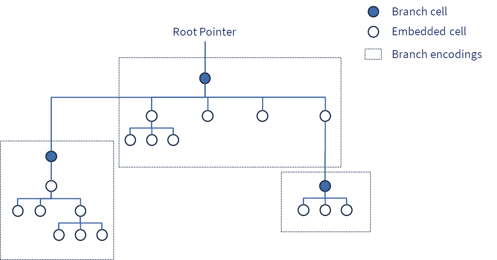

# Encoding Format

## Overview

Convex implements a standard **Encoding** format that represents any valid Convex data values as a **sequence of bytes**. Encoding is an important capability for Convex because:

- It allows values to be efficiently **transmitted** over the network between peers and clients
- It provides a standard format for **durable data storage** of values
- It enables the definition of a cryptographic **Value ID** to identify any value as a "decentralised pointer", which also serves as the root of a Merkle DAG that is the encoding of the complete value.

The Encoding model breaks Values into a Merkle DAG of one or more **Cells** that are individually encoded. Cells are immutable, and may therefore be safely shared by different values, or used multiple times in the the same DAG. This technique of "structural sharing" is extremely important for the performance and memory efficiency of Convex. 


## Basic Rules

### Cells

The fundamental entities that are encoded are called Cells.

Cells may contain other cells by reference, and therefore a top-level cell can be regarded as a directed acyclic graph (DAG). Since cell encodings contain cryptographic hashes of the encodings of any branch referenced cells, this is furthermore a Merkle DAG.

### Branches

Branches are group of cells which are collectively stored in a single encoding.

Branches are an important optimisation, since they reduce the need to produce many small individual cell encodings, and reduce the need for hashing, since only branches need to be hashed to produce references in the Merkle tree.



### Encoding

The encoding MUST be a sequence of bytes.

Any given Cell MUST map to one and only one encoding. 

Any two distinct (non-identical) cells MUST map to different encoding

It MUST be possible to reconstruct the cell from its own encoding, to the extent that the cell represents the same Value (it is possible for implementations to use different internal formats if desired, providing these do not affect the CVM value semantics)

The Encoding MUST have a maximum length of 8191 bytes. This ensure that a cell encoding will always fit within a reasonable fixed size buffer, and guarantees that most operations on cells can achieve `O(1)` complexity.

### Value ID

The value ID of a cell is defined to be the unique SHA3-256 hash of the encoding of the cell.

Since all cells have a unique encoding, they therefore also a unique value ID (subject the the assumption that the probability of SHA3-256 collisions is extremely low).

A value ID reference may be considered as a "decentralised pointer" to an immutable value. 

Note: since only tree roots and branches are likely to be stored in storage systems, users should take care with value IDs that point to intermediate non-branch cells, as these may not be persisted in storage. If in doubt, navigate down from a known root or branch cell value ID.

### References 

A cell encoding MAY contain references to other cells. There are two types of reference:

- Embedded, where the embedded cell's encoding is included within the parent cell encoding 
- Branch, where an external reference is encoded as a byte sequence that includes the Value ID of the referenced cell (i.e. the branch)

From a functional perspective, the difference between an embedded cell and a branch cell is negligible, with the important exception that following a branch reference will require accessing a separate encoding (typically cached in memory, but if necessary loaded from storage).

From a performance perspective however, this distinction is extremely important:

- Embedding allows multiple values to be included in the encoding of a single cell. For example a small Vector like `[1 2 3 4 5]` will be encoded within a single top level cell encoding, with the individual element values being embedded.
- It reduces the number of SHA3-256 hash operations that need to be performed, since typically these need only be computed on branch cells.
- It reduces the overall number of nodes in Merkle DAGs of Cells, reducing the number of individual calls to network and storage functionality.

#### Embedded Cells

A cell may be defined as embedded in which case the cell's encoding is inserted into in the encoding of the parent cell.

If a cell is embedded, it MUST NOT be included in the encoding of another cell by external reference. This restriction is required to guarantee uniqueness of encoding (if not enforced, child cells might be encoded as either an embedded reference or by external reference, thus giving two or more different encodings for the parent cell).

An embedded cell MUST have an encoding of 140 bytes or less. This restriction helps ensure that cell encodings which may contain many child embedded references cannot exceed the overall 8191 byte limit. 

#### External References

An external reference is a reference to a Cell that is not embedded, i.e. points to a branch cell.

An external reference MUST be encoded using the value ID of the target cell. This requirement ensures the integrity of a complete Merkle DAG of cells.

### CVM Values

Most cells represent valid CVM values, i.e. are permitted as first class values in the Convex Virtual Machine. 

Not all cells represent true CVM values, since cells may also be used for internal data structures within larger CVM values, or represent values that are only used outside the CVM.


### Valid and Invalid Encodings

A sequence of bytes is a "valid" encoding is there exists a cell which produces the same sequence of bytes as its encoding. Conversely, a sequence of bytes is an invalid encoding if there is no cell which produces the same sequence of bytes as its encoding.

Implementations MUST be able to reconstruct a cell from any valid encoding.

Implementations MUST recognise an invalid encoding, and in particular:

- Implementations MUST recognise an invalid encoding if the byte sequence contains additional bytes after the end of a valid encoding
- Implementations MUST recognise an invalid encoding if the byte sequence terminates before enough bytes are obtained to complete a valid encoding 

Implementations MUST be able to produce the unique valid encoding for any cell.

### Cell life-cycle

Cells may be constructed in 3 ways:
- Created during local processing
- Received as external input and decoded (will already have encoding)
- Loaded from storage (will have encoding, hash, and storage flags)

## Encoding Format

### Tag Byte

The first byte of the Encoding is defined to be the "tag", which designates the type of the data value, and determines how the remainder of the Encoding should be interpreted.

Implementations MUST reject an Encoding as Invalid if the Tag byte is not recognised as one defined in this document.

### VLC Integers

Integers are normally encoded using a Variable Length Coding (VLC) format. This ensure that small integers have a 1-byte Encoding, and most 64-bit values encoded will have an encoded length shorter than 8 bytes, based on the expected distributions of 64-bit integers encountered in the system.

Encoding rules are:
- The high bit of each byte is `1` if there are following bytes, `0` for the last bytes.
- The remaining bits from each byte are considered as a standard big-endian two's complement binary encoding.
- The highest two's complement bit (i.e. the 2nd highest bit of the first byte) is considered as a sign bit.
- The Encoding is defined to be the shortest possible such encoding for any given integer.

It should be noted that this system can technically support arbitrary sized integers, but in most contexts in Convex it is used for up to 64-bit integer values.

### VLC Counts

VLC Counts are unsigned integer values, typically used where negative numbers are not meaningful, e.g. the size or length of data structures, or for balances that are defined to be non-negative natural numbers. 

Encoding rules are:
- The high bit of each byte is `1` if there are following bytes, `0` for the last bytes.
- The remaining bits from each byte are considered as a standard unsigned big-endian two's complement binary encoding.
- The encoding is defined to be the shortest possible such encoding for any given integer.

Note: VLC Counts are the same as VLC Integers, except that they are unsigned. Having this distinction is justified by frequent savings of one byte, especially when used as counts within small data structures.

### `0x00` Nil

The single byte `0x00` is the encoding for  `nil` value.

### `0xb0` - `0xb1` Boolean

```
Encoding:
0xb0 <=> false
0xb1 <=> true
```

The two Boolean Values `true` or `false` have the Encodings `0xb1` and `0xb0` respectively. 

Note: These Tags are chosen to aid human readability, such that the first hexadecimal digit `b` suggests "binary" or "boolean", and the second hexadecimal digit represents the bit value.  

### `0x10` - `0x18` Integer ("SmallInt")

```Encoding
0x1n <n bytes of numeric data>
```

A small integer value is encoded by the Tag byte followed by `n` bytes representing the signed 2's complement  numeric value of the Integer. The integer must be represented in the minimum possible number of bytes (can be 0 additional bytes for the specific value `0`).

Note: The value zero is conveniently encoded in this scheme as the single byte `0x10`

Note: This encoding is chosen in preference to a VLC encoding because:
- The length of a small integer can be included in the tag, making it more efficient than VLC which requires continuation bits
- It is consistent with the natural encoding for two's complement integers on most systems
- The numerical part is consistent with the format for BigInts

### `0x19` Integer ("BigInt")

```Encoding
0x19 <VLC Count length of Integer = n> <n bytes of data>
```

An Integer is represented by the Tag byte followed by the VLC encoded length of the Integer in bytes. 

The length MUST be at least `9` (otherwise the integer MUST be encoded as a Long).

With the exception of the Tag byte, The encoding of a BigInt is defined to be exactly equal to a Blob with `n` bytes.

### `0x1d` Double

```Encoding
0x1d <8 bytes IEEE 764>
```

A Double value is encoded as the Tag byte followed by 8 bytes standard representation of an IEEE 754 double-precision floating point value.

### `0x3c` - `0x3f` Character

```Encoding
Tag determines the length in bytes of the Unicode code point value
0x3c <1 Byte>
0x3d <2 Bytes>
0x3e <3 Bytes>
0x3f <4 Bytes> (reserved, not currently possible?)
```

A Character value is encoded by the Tag byte followed by 1-4 bytes representing the Unicode code point as an unsigned integer.

A Character encoding is invalid if:
- More bytes are used than necessary (i.e. a leading byte of zero)
- The code point is beyond the maximum allowable (0x10ffff) 

### `0x20` Ref

```Encoding
0x20 <32 bytes Value ID>
```
An external reference is encoded as the Tag byte followed by the 32-byte value ID (which is in turn defined as the SHA3-256 hash of the encoding of the referenced value). They are not themselves cell values, rather they represent a reference to another cell

Ref encodings are used as substitutes for child values contained within other cell encodings subject to the following rules:
- They MUST be used whenever the child cannot be embedded (i.e. is a branch cell). 
- They MUST NOT be used when the child cell is embedded. 

These rules are necessary to ensure uniqueness of the parent encoding (otherwise, there would be two versions, one with an embedded child and the other with a external ref ).

### `0x21` Address

```Encoding
0x21 <VLC Count>
```

An Address value is encoded by the Tag byte followed by a VLC Encoding of the 64-bit value of the Address. 

Since Addresses are allocated sequentially from zero (and Accounts can be re-used), this usually results in a short encoding.

### `0x30` String

```Encoding
If String is 4096 UTF-8 bytes or less:

0x30 <VLC Count = n> <n bytes UTF-8 data>

If String is more than 4096 Bytes:

0x30 <VLC Count = n> <Child String Value>(repeated 2-16 times)
```

Every String encoding starts with the Tag byte and a VLC-encoded length.

Encoding then splits depending on the String length `n`.
- If 4096 characters or less, the UTF-8 bytes of the String are encoded directly (`n` bytes total)
- If more than 4096 bytes, the String is broken up into a tree of child Strings, where each child except the last is the maximum sized child possible for a child string (1024, 16384, 262144 etc.), and the last child contains all remaining characters. Up to 16 children are allowed before the tree must grow to the next level.

Because child strings are likely to be non-embedded (because of encoding size) they will usually be replaced with Refs (33 bytes length). Thus a typical large String will have a top level cell encoding of a few hundred bytes, allowing for a few child Refs and a (perhaps embedded) final child. 

Importantly, this design allows:
- Arbitrary length Strings to be encoded, while still keeping each cell encoding smaller than the fixed maximum size
- Structural sharing of tree nodes, giving O(log n) update with path copying
- Relatively low overhead, because of the high branching factor: not many branch nodes are required and each leaf note will compactly store 1024 characters.

Note with the exception of the Tag byte, String encoding is exactly the same as a Blob

### `0x31` Blob

```Encoding
If Blob is 4096 bytes or less:

0x31 <VLC Count = n> <n bytes>

If Blob is more than 4096 bytes:

0x31 <VLC Count = n> <Child Blob Value>(repeated 2-16 times)
```

Every Blob encoding starts with the Tag byte and a VLC-encoded length.

Encoding then splits depending on the Blob length `n`.
- If 4096 bytes or less, the bytes of the Blob are encoded directly (`n*2` bytes total)
- If more than 4096 byte, the Blob is broken up into a tree of child Blobs, where each child except the last is the maximum sized child possible for a child Blob (4096, 65536, 1048576 etc.), and the last child contains all remaining Bytes. Up to 16 children are allowed before the tree must grow to the next level.

Because child Blobs are likely to be non-embedded (because of Encoding size) they will usually be replaced with Refs (33 bytes length). Thus a typical large Blob will have a top level cell encoding of a few hundred bytes, allowing for a few child Refs and a (perhaps Embedded) final child. 

Importantly, this design allows:
- Arbitrary length Blobs to be encoded, while still keeping each Blob encoding within a fixed size
- Structural sharing of tree nodes, giving O(log n) update with path copying
- Relatively low overhead, because of the high branching factor: not many branch nodes are required and each leaf note will compactly store 4096 bytes.

### 0x32 Symbol

```Encoding
0x32 <VLC Count = n> <n bytes UTF-8 String>
```

A Symbol is encoded with the Tag byte, a VLC Count length `n`, and `n` bytes of UTF-8 encoded characters.

The Symbol MUST have a length of 1-128 UTF-8 bytes

### `0x33` Keyword

```Encoding
0x32 <VLC Count = n> <n bytes UTF-8 String>
```

A Keyword is encoded with the Tag byte, a VLC Count length `n`, and `n` bytes of UTF-8 encoded characters.

The Keyword MUST have a length of 1-128 UTF-8 bytes

### `0x80` Vector

```Encoding
If a Leaf Count:

0x80 <VLC Count = n> <Prefix Vector> <Value>(repeated 0-16 times)

If a non-Leaf Count:

0x80 <VLC Count = n> <Child Vector>(repeated 2-16 times)
```

A Leaf Count `n` is defined as 0, 16, or any other positive integer which is not an exact multiple of 16.

A Vector is defined as "packed" if its Count is `16 ^ level`, where `level` is any positive integer. Intuitively, this represents a Vector which has the maximum number of elements before a new level in the tree must be added.

All Vector encodings start with the Tag byte and a VLC Count of elements in the Vector.

Subsequently:
- For Leaf Vectors, a Prefix Vector is encoded (which may be `nil`) that contains all elements up to the highest multiple of 16 less than the Count, followed by the Values
- For non-Leaf Vectors, Child Vectors are encoded where each child is the maximum size Packed Vector less than Count in length, except the last which is the Vector containing all remaining Values.

This Encoding has some elegant properties which make Convex Vectors particularly efficient in regular usage:
- Short Vectors (0-16 Count) are always encoded in a single Cell, which may require no further cell encodings in the common case that all elements are embedded.
- The last few elements of the Vector are usually in a Leaf Vector, which allows `O(1)` access and update to elements
- Append is always `O(1)` (since either it is a Leaf Vector, or the append creates a new Leaf Vector with the original Vector as its Prefix)
- For practical purposes, access and update is also `O(1)` (Note: technically `O(log n)` with a high branching factor, but upper bounds on vector size make this `O(1)` with a constant factor that accounts for the maximum possible depth)

### TODO: More tags

## Implementation Notes

In the Convex JVM implementation, cells are represented by subclasses of the class `convex.core.data.ACell`. Having a common abstract base class is helpful for performance, allows for convenient implementation of common cell functionality, and ensures that all cell instances are designed to work with a common abstract class interface.

The JVM `null` value is interpreted as the Convex `nil` value. This is an implementation decision, chosen for efficiency and performance reasons. However there is no strict requirement that `nil` must be represented this way (for example, it could alternatively be a singleton value). 
