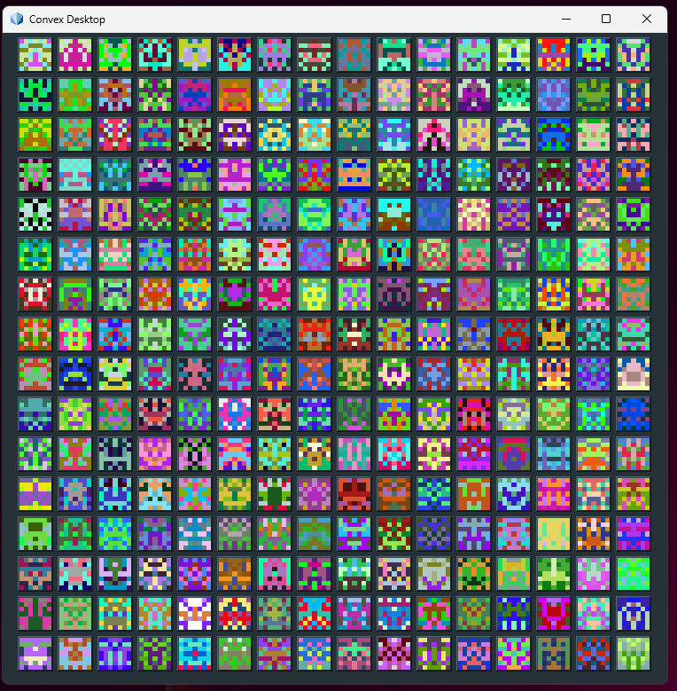

# Accounts

## Overview

Accounts are a fundamental construct in Convex - they are logical records in the CVM State that are either securely controlled by an external user, or operate as autonomous actors. 

Accounts are identified with an address, which are sequentially allocated in the form `#1567`

Accounts are the primary means of managing security and access control for on-chain transactions. Any transaction executed by Convex must be associated with a user account and signed with a valid digital signature. This protects the user's account from unauthorised access. Any user account used in this way must have a 32-byte Ed25519 public key, of the form `0x9D98C7C6B9E89AEC23F4AF6D5175872C25982264AD91E95DC4B061EE3062BFD1`. If an account is not able to accept external transactions, it's public key is set to `nil`.

Accounts also constitute the largest part of the on-chain CVM State. Accounts are used to store code and data, and to track holdings of various digital assets. In the future, accounts will probably constitute over 99% of the CVM State size - there isn't much else apart from data structure to support peers managing consensus and a little network-global data.

## Key Concepts

### Addresses

Every account has an address, which is a unique ID that identified the account. Addresses are conventionally shown in the format `#1234`, and are primitive values in the CVM in their own right.

Addresses are assigned sequentially whenever new accounts are created. It is impossible to change the address of an account once created - this is important because the Address is intended to be a stable unique identifier for the account.

Addresses are recommended to be used as the unique ID for access control mechanisms, e.g. an actor might maintain a `Set` of addresses which are allowed to execute a security-critical operation.

Addresses are also typically used as the key for indexed data structures that track ownership of digital assets. A common pattern is to represent ownership as a `Map` of addresses to numbers representing balances of the appropriate digital asset(s).

### User Accounts

User accounts are accounts controlled / owned by individuals or organisations that use the Convex Network.

A user account is defined as an account with a public key defined, which is used to validate the digital signature of transactions. The associated private key is assumed to be under the secure control of an external user. 

A user account is considered the origin account during the execution of any transaction submitted for this account.

### Actor Accounts

Actor accounts are autonomous accounts that manage trusted code and data. They can be considered as autonomous software components operating on the Convex Network. Typical applications of actors might include:
- Implementing a digital asset such as a fungible token or collection of NFTs
- Providing a public registry of accredited organisations
- An auction house that manages multiple concurrent auctions, and ensures winners correctly receive their purchased items
- Providing a shared code library for other accounts to utilise

An actor account is defined as any account with no public key.

Actors do nothing on their own initiative (with some limited exceptions e.g. scheduled operations). They need to be invoked by other accounts, e.g. a user will typically `call` an exported actor function from their own account. 

### Identicons

Accounts may be given an "identicon" which visually represents the public key of an account. 

Identicons are optional and intended for user interfaces where public keys are used and must be kept secure. Different GUIs may implement alternative identicon schemes, however the Convex Desktop used the following approach and other applications are invited to adopt the same format:

- Identicons are 7x7 pixel bitmaps, symmetric about vertical axis
- 4 colours, taken from last 12 bytes of key (3 RGB bytes each)
- First 7 bytes of key define unique pixels, 2 bits each, i.e. one byte for each row of the identicon
- The identicon for a null value is defined to be a black box (useful for identifying actors etc. with no public key)

### Lisp Machine

Each account can be considered as a small, lightweight lisp machine! It has its own programmable environment, and can be interacted with via transactions (write) or queries (read-only).

There's no limit on what can be done with this capability, as the CVM provides a fully Turing complete programming environment. You can control an account with a REPL, use it to script various on-chain operations, use it as a temporary environment for on-chain smart contract development etc.

### Controllers

Controllers allow an account to be controlled by other accounts, as an alternative or in addition to the use of transactions signed with the account key. Typical purposes might include:
- Allowing a trusted third party to recover the account if the user's private key is lost
- Allowing a maintainer to make upgrades to an actor
- Allowing a DAO to receive instructions from an actor that manages votes on proposals

Optionally, an account may define a controller, giving the ability to one or more other accounts to control the account. The controller may be a specific address of another account, or a trust monitor that permits access to an arbitrary set of accounts that may be defined in code (e.g. accounts authorised by a governance actor or DAO). 

This is a powerful capability. A controller account can be used, for example, to give "root" access to an actor so that it can be upgraded or debugged after deployment.

It is also a risk: Users SHOULD NOT set a Controller for any higgh value account they wish to keep secure unless:
- They know exactly what they are doing
- They fully trust the account(s) they are giving controller access to.

dApps MAY set an account controller to be used as an account recovery mechanism, with the ability to reset the account's public key in the case that access to the original key pair is lost. A possible implementation is to use a time locked smart contract that updates the account after some delay, that can be cancelled in the case of a suspected attack or if the original key is found again.

### Recycling Accounts

It is possible to recycle old accounts, perhaps even selling them! This is likely to be cheaper and more efficient than creating a new account, since it will save memory. It also helps keep the CVM state smaller overall.

An example procedure for doing this securely is:
- Transfer away any digital assets or other access control rights you want to keep
- Set the controller to `nil`
- Delete unwanted definitions from the account's environment with `undef`
- Especially, it is important to delete:
  - any exported functions that might be called externally
  - The `*schedule-start*` value, which may enable scheduled operations
- Set the account public key to the public key of the new owner

With this method, accounts may be re-used by different individuals, with the secure knowledge that the previous owner(s) no longer have any control over the account. 

## Account Specification

The account is represented a data structure within the state of the CVM.

Each valid address MUST have precisely one account record in the global state.

If a state transition causes an update to information in the account record (e.g. changing a definition in the environment), the new state MUST reflect the account update.

The account record (`AccountStatus` in the standard reference implementation) MUST be a valid CVM Record data structure with Keyword keys as follows:
- `:sequence` - sequence number of the account, initially `0`
- `:key` - account key, may be `nil` to indicate an actor, otherwise a 32 byte Blob representing an Ed25519 public key
- `:balance` - balance of the account in Convex copper coins (a 64-bit natural number)
- `:allowance` - unused memory allowance of the account, normally `0` but may be higher (e.g. if a memory accounting refund occurred)
- `:holdings` - map of holdings of the account, attributed to any other accounts which have utilised `set-holding` (e.g. token actors)
- `:controller` - a controller account, which has the power to issue commands for this account (e.g. `eval-as`)
- `:environment` - a map of symbols to defined values in the account, initially `{}`
- `:metadata` - a map of symbols to metadata for values defined in the account, if any. Initially `{}`
- `:parent` - an optional address that is used to resolve symbols by default if not otherwise defined in this account. Initially `nil`

### Sequence Number

The sequence number's primary purpose is to prevent replay attacks, since the same signed transaction with the same sequence number cannot be re-used.

The sequence number MUST indicate the number of transactions which have been executed for this account.

The sequence number MUST be `0` for a new account, or any account for which transactions have never been previously executed (e.g. an immutable actor)

The sequence number MUST increase by `1` for each correctly signed transaction executed. 

### Account Key

The account key's purpose is to specify which cryptographic key (if any) can be used to control the account

Each account MAY have a single account key.

If the account key exists, it MUST be a 32 byte `Blob`.

If the account key is not specified for the account, it MUST be treated as the value `nil` when accessed.

The account key SHOULD represent a valid Ed25519 public key for which the owner of the user account is expected to have access to the corresponding private key. Security of the private key is the responsibility of the external user.

The CVM MUST NOT process transactions for an account unless the Ed25519 digital signature on the transaction can be verified with the account key. See CAD10 for more details.

The account key MAY be changed by a controller of the account to a new account key, or set to `nil`.

### Balance

The balance field enables each account to hold a quantity of Convex Coins.

The balance field MUST be a non-negative integer indicating the number of Convex copper coins controlled directly by the account.

### Allowance

The allowance field enables each account to hold a pre-alloacted allowance of CVM memory for future use. If this is zero, any new memory allocations must be purchased at the prevailing memory pool price at the time the transaction completes.

If a user's transactions result in a memory refund (by reducing the size of the global state), the refund is deposited automatically in the allowance field. The user may then utilise this memory for another purpose, or sell it if no longer required.

The allowance field MUST be a non-negative integer indicating the number of bytes of unused memory allowance held by the account.

### Holdings

The holdings field is an efficient way for actors to optionally store some data referring to each other account on the system. For example, it might be used to store a balance of actor-defined tokens that are held by the account.

The holdings field MUST be a Index representing a mapping of Address to holding values. 

Values MAY be any CVM value.

Holding values SHOULD be meaningfully defined by the address that sets them.

### Controller

The controller field MAY be any CVM value, including `nil` 

If set to a specific Address, the CVM MUST regard that address as a controller.

The CVM MUST regard any non-`nil` value in this field as defining a trust monitor, and check as if called with `(call controller (check-trusted? <caller> :control <account-address>))` to determine whether another account should be regarded as a controller.

If another account is regarded as a controller, it MUST be able to control the account in its entirely, including use of `eval-as`.

### Environment

The environment field MUST be a map of Symbols to defined values in the account.

The environment field MUST be `{}` when initially created.

### Metadata

The metadata field MUST be a map of Symbols to defined metadata in the account.

The metadata field MUST be `{}` when initially created.

CVM operations MAY set values in the environment without setting equivalent values in the metadata. This is primarily for efficiency purposes, as most environment values do not require metadata.

### Parent

The parent field MUST be `nil` when the account is initially created

