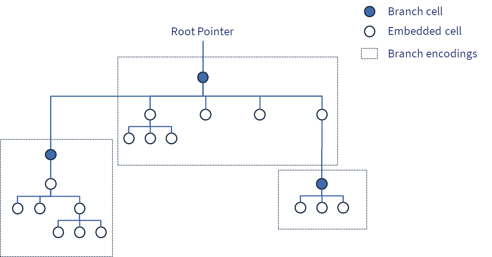

# CAD003: Encoding Format

## Overview

Convex uses the standard **CAD3 Encoding** format that represents any valid lattice data value as a **sequence of bytes**. The CAD3 encoding is an important capability for Convex because:

- It allows values to be efficiently **transmitted** over the network between peers and clients
- It provides a standard format for **durable data storage** of values
- It defines a cryptographic **value ID** to identify any value. This is a decentralised pointer, which also serves as the root of a Merkle DAG that represents the complete encoding of a value.

The encoding model breaks values into a Merkle DAG of one or more **cells** that are individually encoded. Cells are immutable, and may therefore be safely shared by different values, or used multiple times in the the same DAG. This technique of "structural sharing" is extremely important for the performance and memory efficiency of Convex. 

## Special Requirements

Convex and related lattice infrastructure have some very specific requirements for the encoding format which necessitate the design of the encoding scheme design here:

- A **unique canonical encoding** for every value, such that it can be hashed to a stable ID
- An **efficient binary format** for both storage and transmission
- A **self describing** format - no additional schema is required to read an encoding
- Provision of **immutable persistent data structures** for the lattice data values used in Convex
- Automatic generation of a verifiable **Merkle DAG** via references to other value IDs
- Support for rich **data types** used in the CVM and lattice data (Maps, Sets, Vectors, Blobs etc.)
- Data structure of **arbitrary size** may be represented. The lattice is huge.
- Support for **partial data**: we often need to transmit deltas of large data structures, so need a way to build these deltas and reconstruct the complete structure when they are received (assuming existing data can fill the gaps)
- Ability to read encode / decode `n` bytes of data in `O(n)` time and space to ensure **DoS resistance**
- Fixed upper bound on the encoding size of any value (excluding referenced children) so that reading and writing can occur in fixed sized buffers - this allows **streaming capabilities** including zero-copy operations.

No existing standard was identified that meets these requirements, e.g.
- XML and JSON are inefficient text based formats, and lack unique representations of the same data
- Google's protocol buffers require external schemas (and does not usually guarantee a unique canonical encoding) 
- ASN.1 is over-complex, generally relies on schemas and doesn't encode into bounded units suitable for building merkle trees or streaming data through fixed size buffers

## Examples

### Small Integer value

The Integer `19` is encoded as: 
- tag of 0x11 (one byte integer) 
- the hex value 0x13  

```
0x1113
```

### Vector with external reference

A Vector (length 2) containing The Integer 19 and another non-embedded value is encoded as:
- `0x80` tag for a Vector
- `0x02` count of Vector elements
- `0x1113` embedded encoding of the Integer 19
- `0x20` tag for a non-embedded external value reference
- The value ID = hash of the referenced value's encoding

```
0x800211132028daa385e6b97d3628e1deecb412c7d4e98135e204d0661c92ba885ff23d2b94
```

On its own, the encoding above is a valid encoding for a single cell, but the encoding of the referenced value would need to be obtained in order to examine the second element - which could include petabytes of data. This is an example of a "partial" value.

### A 1GB Blob

A Blob of length 1GB, specified with:
- `0x31` tag for a Blob
- `0x8480808000` VLQ encoded length of 2^30
- `0x20`+child value ID (repeated 16 times, each child is a 64mb Blob)

```
0x31848080800020af61c2faf10511466f73fe890524dccc056bddc79df37c7fbb
  1823d5c8dae191202144a7641028ccd2259792d4c9626feb7f3cfb631eb7473d
  3b95f1312fc4bf05202426c963ce5e0032fff92a028deec91a7466dd6d970cf4
  78e510033854f6499120b2165e855dddd0daf62ba138ba0c1553a347b7f9f635
  a589a2f9ab50be67c65120c7e6b0c74f27af4771ef06304fb02988bcd3bbe8f7
  c2af84d3262d36f9ab75a620e8000a3edfa7bd1321c5d40e36a52c3c93d2be03
  d976df15fd2323796c43435f201de13753be217f7fe3b89effaf7f2f5326bff4
  94b50c1d86d96eeeb537bfcd5e205b2e93772a254a5196662707c68e851d16e3
  a9386df7b40183daf82389d761032095ed2e62b005d363d33ccd4794ecc9f9f3
  bae35979151ee1e340555e6d265a0820cf0902e3f9ca79469ed03e25085ad14b
  dea6a03fe41299ce538837e1e3666e3a20d614113ed517586ec7fe3576a9ce90
  66f4795efbe85315fa0f6872085a408d4120ff5d93db343c185b47484aef9bd8
  e1c5d171e87762960b659344b0aeda6ba0ba20fb047cfd86c9b81883b7920a44
  f5f8909f6360a5e2f2d2d4ee4639d554ab7801202ad7a5b7bafc6d323f3d6ec1
  4288775095775eb7d72f63cebffae6a0438ccb1120afc2b4cb2ed7c26d7026b1
  74a22979bf4cf09468d5a31d33dca1aad04df0b1cc207881f54f571cd0416e5a
  f36bc6f133660bf8a60b4ded525332f9a314bea4ddea
```

## Basic Rules and Concepts

### Cells

The fundamental entities that are encoded are called cells.

Cells may contain other cells by reference, and therefore a top-level cell can be regarded as a directed acyclic graph (DAG). Since cell encodings contain cryptographic hashes of the encodings of any referenced cells, this is furthermore a Merkle DAG.

### Branches

Branches are group of cells which are collectively stored in a single encoding.

Branches are an important optimisation, since they reduce the need to produce many small individual cell encodings, and reduce the need for hashing, since only branches need to be hashed to produce references in the Merkle tree.



### Encoding

A CAD3 encoding MUST be a sequence of bytes.

Any given cell MUST map to one and only one encoding. 

Any two distinct (non-identical) cells MUST map to different encoding

It MUST be possible to reconstruct the cell from its own encoding, to the extent that the cell represents the same Value (it is possible for implementations to use different internal formats if desired, providing these do not affect the CVM value semantics)

The encoding MUST have a maximum length of 16383 bytes. This ensure that a cell encoding will always fit within a reasonable fixed size buffer, and guarantees that most operations on can achieve `O(1)` complexity.

### Value ID

The value ID of a cell is the SHA3-256 hash of the encoding of the cell.

All cells have a unique encoding, therefore they also have a unique value ID (subject the the assumption that the probability of SHA3-256 collisions is extremely low).

A value ID reference may be considered as a "decentralised pointer" to an immutable value. 

Note: since only tree roots and branches are likely to be stored in storage systems, care should be taken with value IDs that point to intermediate non-branch cells, as these may not be persisted in storage. If in doubt, navigate down from a known root or branch cell value ID.

### References 

A cell encoding MAY contain references ("Refs") to other cells. There are two types of reference:

- **Embedded**, where the embedded cell's encoding is included within the parent cell encoding 
- **Branch**, where an external reference is encoded as a byte sequence that includes the Value ID of the referenced cell (i.e. the branch)

From a functional perspective, the difference between an embedded cell and a branch cell is negligible, with the important exception that following a branch reference will require accessing a separate encoding (typically cached in memory, but if necessary loaded from storage).

From a performance perspective however, this distinction is extremely important:

- Embedding allows multiple values to be included in the encoding of a single cell. For example a small Vector like `[1 2 3 4 5]` will be encoded within a single top level cell encoding, with the individual element values being embedded.
- It reduces the number of SHA3-256 hash operations that need to be performed, since typically these need only be computed on branch cells.
- It reduces the overall number of nodes in Merkle DAGs of Cells, reducing the number of individual calls to network and storage functionality.
- A typical branch will have a relatively high branching factor (e.g. 10-30 child references) - this helps to navigate quickly down to leaf cells with the minimum number of IO operations.

#### Embedded References

A cell may be defined as embedded in which case the cell's encoding is inserted into in the encoding of the parent cell.

If a cell is embedded, it MUST NOT be included in the encoding of another cell by external reference. This restriction is required to guarantee uniqueness of encoding (if not enforced, child cells might be encoded as either an embedded reference or by external reference, thus giving two or more different encodings for the parent cell).

An embedded cell MUST have an encoding of 140 bytes or less. This restriction helps to ensure that cell encodings which may contain many child embedded references cannot exceed the overall 16383 byte limit. 

#### External References

An external reference is a reference to a cell that is not embedded, i.e. points to a branch cell.

An external reference MUST be encoded using the value ID of the target cell. This requirement ensures the integrity of a complete Merkle DAG of cells.

### Data Structures

Data structure (such a Maps, Vectors etc.) are designed to operate as trees of cells.

Each child cell is itself a valid data structure representing a subset of the whole data structures. For example, a Vector with 256 elements is a tree root containing 16 references to child vectors with 16 elements each.

This approach is important for several reasons:
- It is a natural way to structure the components cells of the data structure as a Merkle DAG
- The child cells can be re-used as valid data structures elsewhere (e.g. allowing structural sharing of common subsequences of vectors)
- It ensures that each child cell is a valid cell with a unique encoding in its own right
- It allows fast indexed and sorted access into data structures (similar to B-trees)

### CVM Values

Most cells represent valid CVM values, i.e. are permitted as first class values in the Convex Virtual Machine. 

Not all cells represent true CVM values, since cells may also be used for internal data structures within larger CVM values, or represent values that are only used outside the CVM.

### Valid and Invalid Encodings

A sequence of bytes is a "valid" encoding if there exists a cell which produces the same sequence of bytes as its encoding. Conversely, a sequence of bytes is an invalid encoding if there is no cell which produces the same sequence of bytes as its encoding.

Implementations MUST be able to reconstruct a cell from any valid encoding.

Implementations MUST recognise an invalid encoding, and in particular:

- Implementations MUST recognise an invalid encoding if the byte sequence contains additional bytes after the end of a valid encoding
- Implementations MUST recognise an invalid encoding if the byte sequence terminates before enough bytes are obtained to complete a valid encoding 

Implementations MUST be able to produce the unique valid encoding for any cell.

Note: Random byte strings are almost always invalid. This is a good thing, because it allows us to quickly reject corrupt or malicious data. This property is due to the multiple constraints on validity:
- Quite a few tags are illegal / reserved
- Within each value, there are significant constraints on validity (correct VLQ counts, embedded children must be 140 bytes or less etc.)
- Even for an otherwise valid encoding, the length of the encoding must be exactly correct

### Extensibility

CAD3 is designed for applications to use, and is therefore **extensible**. 

This is an important aspect of the design: Just like HTTP does not enforce a specific meaning on content included in a PUT request, CAD3 does not specify how an application might choose to interpret specific CAD3 encoded values.

Applications using CAD3 encodings MAY assign semantic meaning to values on an application-specific basis.

Applications SHOULD honour the logical meaning of defined CAD3 types, e.g.:
- A CAD3 Integer should represent an integer value in the application (in some cases it might be repurposed e.g. as a code value)
- A CAD3 String should be treated as a UTF-8 string if the application supports strings / text data.

Applications SHOULD use the Blob type (`0x31`) for data which has a different binary encoding. This allows applications to encode arbitrary data in CAD3 structures with custom encodings or using other standards.

Implementations MUST preserve CAD3 encoded values, even if they do not recognise the meaning. This ensures that implementations are compatible and can relay application specific data even if they do not understand it.

In practice this means:
- Applications can define what a particular cell value means in context, e.g. the vector `[1 17 :owns]` might represent an edge in a graph where entity `1` "owns" entity `17`
- Certain categories of values (`0xAn`, `0xCn`, `0xDn` and `0xEn`) are explicitly intended for application usage
- Independent of semantic meaning, applications can encode and decode arbitrary CAD3 data using a suitable implementation library. 

## Encoding Format

### Tag Byte

The first byte of the encoding is defined to be the "tag", which designates the general type of the data value, and determines how the remainder of the encoding should be interpreted.

Implementations MUST reject an encoding as invalid if it starts with a tag byte that is not defined in this document.

Tags are designed with the following objectives:
- The tag byte enables very fast branching regarding how to interpret the following bytes
- We use enough unique tags so that the 1 byte conveys a meaningful amount of information. Every bit counts!
- Plenty of tag bytes are still available for future extension
- The hex values convey at least some meaning to experienced human readers. `nil` is `00`. Numbers start with `1`. booleans start with `b`. `ff` is fatal failure etc.

### Categories

The high hex digit of each tag byte specifies the general category of teh data value. These are defined as follows:

| Pattern  | Category             | Purpose |
| -------- | -------------------- | -------- |
| 0x0x     | Basic constants      | Special values like `nil` |
| 0x1x     | Numerics             | Integers, Doubles |
| 0x2x     | References           | Addresses, References to branch values |
| 0x3x     | Strings and Blobs    | Raw Blob data, UTF-8 Strings etc. |
| 0x4x     | Reserved             | Reserved for future use |
| 0x5x     | Reserved             | Reserved for future use |
| 0x6x     | Reserved             | Reserved for future use |
| 0x7x     | Reserved             | Reserved for future use |
| 0x8x     | Data Structures      | Containers for other values: Maps, Vectors, Lists, Sets etc. |
| 0x9x     | Cryptography         | Digital Signatures etc. |
| 0xAx     | Sparse Records       | For application usage, records that frequently omit fields  |
| 0xBx     | Byte Flags           | One-byte flag values (0xB0 and 0xB1 used as booleans) |
| 0xCx     | Coded Values         | For application usage, values tagged with an code value |
| 0xDx     | Data Records         | For application usage, records that have densely packed fields |
| 0xEx     | Extension Values     | For application usage |
| 0xFx     | Special Values       | Mostly reserved, 0xFF is illegal |

The categories have been designed with the following purposes in mind:
- Include all key fundamental types for decentralised lattice data structures
- Allow rapid recognition of general types based on the first hex digit
- Extensibility: several categories are designed for flexible application usage 
- Some degree of human interpretability (from looking at hex values)
- Reasonable space for future extension

### VLQ Counts

VLQ Counts are unsigned integer values expressed in a base-128 encoding using a Variable Length Quantity (VLQ) format. They are useful where values are usually small and negative numbers are not meaningful, e.g. the size or length of data structures.

Encoding rules are:
- The high bit of each byte is `1` if there are following bytes, `0` for the last bytes.
- The remaining bits from each byte are considered as a standard unsigned big-endian two's complement binary encoding.
- The encoding is defined to be the shortest possible such encoding for any given integer.

In data structures, a VLQ Count is frequently used to specify the number of elements in the data structure.

It should be noted that this system can technically support arbitrary sized integers, however for use in CAD3 encoding it is limited to up to 63-bit integer values. It seems unlikely that anyone will ever actually need to construct or encode a data structure with this many elements, so this may be considered sufficiently future-proof.

Note: In the Convex reference implementation a signed variant (VLC Long) is also available. This is not currently used in CAD3.

### `0x00` Nil

The single byte `0x00` is the encoding for the `nil` value.

`nil` is conventionally used to indicate the absence of a value in applications. 

### `0x10` - `0x18` Integer (Long)

```Encoding
0x1n <n bytes of numeric data>
```

A Long value is encoded by the Tag byte followed by `n` bytes representing the signed two's complement numeric value of the Integer. The Integer MUST be represented in the minimum possible number of bytes - excess leading sign bytes are an invalid encoding.

Note: The value zero is conveniently encoded in this scheme as the single byte `0x10`

Note: This encoding is chosen in preference to a VLQ encoding because:
- The length of a small integer can be included in the tag, making it more efficient than VLQ which requires continuation bits
- It is consistent with the natural encoding for two's complement integers on most systems
- The numerical part is consistent with the format for BigInts

### `0x19` Integer (BigInt)

```
0x19 <VLQ Count length of Integer = n> <n bytes of data>
```

A "Big" Integer is represented by the tag byte `0x19` followed by the VLQ encoded length of the Integer in bytes. 

The Integer MUST be represented in the minimum possible number of bytes - excess leading sign bytes are an invalid encoding. This is necessary to ensure an unique encoding for every Integer.

The length MUST be at least `9` (otherwise the integer MUST be encoded as the Long version of Integer).

With the exception of the tag byte, The encoding of a BigInt is exactly the same as a Blob with `n` bytes.

### `0x1d` Double

A Double is an IEEE754 double precision floating point value.

```
0x1d <8 bytes IEEE 764>
```

A Double value is encoded as the Tag byte followed by 8 bytes standard representation of an IEEE 754 double-precision floating point value.

All IEEE754 values are supported except that the `NaN` value MUST be represented with the specific encoding `0x1d7ff8000000000000` when used within the CVM. This is to ensure a unique encoding of `NaN` values which are otherwise logically equivalent.

### `0x20` Ref

A Ref is a special encoding that points to a branch cell encoding using its value ID (cryptographic hash).

```
0x20 <32 bytes Value ID>
```

An external reference is encoded as the tag byte followed by the 32-byte value ID (which is in turn defined as the SHA3-256 hash of the encoding of the referenced value). They are not themselves cell values, rather they represent a reference to another cell

An implementation MUST NOT allow a Ref as a a valid encoding in its own right: it must be included in another encoding.

Ref encodings are used for child values contained within other cell encodings subject to the following rules:
- They MUST be used whenever the child cannot be embedded (i.e. is a branch cell). 
- They MUST NOT be used when the child cell is embedded. 

These rules are necessary to ensure uniqueness of the parent encoding (otherwise, there would be two or more encodings for many values, e.g. one with an embedded child and the other with a external branch ref ).

### `0x21` Address

Addresses are used to reference sequentially allocated accounts in Convex. 

```
0x21 <VLQ Count = address number>
```

An Address value is encoded by the tag byte followed by a VLQ Encoding of the 64-bit value of the Address. 

The address number MUST be positive, i.e. a 63-bit positive integer.

Since addresses are allocated sequentially from zero (and Accounts can be re-used), this usually results in a short encoding.

Addresses MAY be used by implementations outside the CVM for other types of sequentially allocated values.

### `0x30` String

A String is a sequence of bytes with UTF-8 string encoding assumed.

```
If String is 4096 bytes or less:

0x30 <VLQ Count = n> <n bytes data>

If String is more than 4096 Bytes:

0x30 <VLQ Count = n> <Child Blob>(repeated 2-16 times)
```

Every String encoding starts with the tag byte and a VLQ-encoded length.

Encoding then splits depending on the String length `n`.
- If 4096 characters or less, the UTF-8 bytes of the String are encoded directly (`n` bytes total)
- If more than 4096 bytes, the String is broken up into a tree of child Blobs, where each child except the last is the maximum sized child possible for a child string (1024, 16384, 262144 etc.), and the last child contains all remaining characters. Up to 16 children are allowed before the tree must grow to the next level.

Because child strings are likely to be non-embedded (because of encoding size) they will usually be replaced with Refs (33 bytes length). Thus a typical large String will have a top level cell encoding of a few hundred bytes, allowing for a few child Refs and a (perhaps embedded) final child. 

Importantly, this design allows:
- Arbitrary length Strings to be encoded, while still keeping each cell encoding smaller than the fixed maximum size
- Structural sharing of tree nodes, giving O(log n) update with path copying
- Low overhead because of the high branching factor: not many branch nodes are required and each leaf note will compactly store up to 4096 characters
- Most of the implementation can be shared with Blobs

Note: UTF-8 encoding is assumed, but not enforced in encoding rules. Implementations MAY decide to allow invalid UTF-8.

Note: with the exception of the tag byte, String encoding is exactly the same as a Blob. This includes the fact that the children of Strings are in fact Blobs.

### `0x31` Blob

A Blob is an arbitrary length sequence of bytes (Binary Large OBject).

```
If Blob is 4096 bytes or less:

0x31 <VLQ Count = n> <n bytes>

If Blob is more than 4096 bytes:

0x31 <VLQ Count = n> <Child Blob>(repeated 2-16 times)
```

Every Blob encoding starts with the tag byte and a VLQ-encoded length.

Encoding then varies depending on the Blob length `n`.
- If 4096 bytes or less, the bytes of the Blob are encoded directly (`n` bytes following the VLQ Count)
- If more than 4096 bytes, the Blob is broken up into a tree of child Blobs, where each child except the last is the maximum sized child possible for a child Blob (4096, 65536, 1048576 etc.), and the last child contains all remaining bytes data. Up to 16 children are allowed before the tree must grow to the next level.

Applications MAY include whatever data or encoding they wish within Blobs.

Applications SHOULD use Blobs for binary data where the data is not otherwise meaningfully represented as a CAD3 type. Examples might include PNG format image data, a binary database file, or text in an encoding other than UTF-8.

Applications SHOULD use Blobs for data which is naturally represented as a string of bytes, e.g. cryptographic hashes or signatures.

Because child Blobs are likely to be non-embedded (because of encoding size) they will usually be replaced with Refs (33 bytes length). Thus a typical large Blob will have a top level cell encoding of a few hundred bytes, allowing for a few child Refs and a final child for the remaining bytes (which may be embedded). 

Importantly, this design allows:
- Arbitrary length Blobs to be encoded, while still keeping each Blob encoding within a fixed size
- Structural sharing of tree nodes, giving `O(log n)` updates with path copying
- Relatively low overhead, because of the high branching factor: not many branch nodes are required and each leaf note will compactly store 4096 bytes.

### `0x32` Symbol

Symbols are used for naming things, e.g. a CNS name like `convex.core`.

```
0x32 <Count Byte = n> <n bytes UTF-8 String>
```

A Symbol is encoded with the tag byte, an unsigned count byte `n`, and `n` bytes of UTF-8 encoded characters.

The Symbol MUST have a length of 1-128 UTF-8 bytes. Any other length is invalid. This guarantees that all Symbols are embedded.

Applications SHOULD use Symbols when referring to named values that need to be externally looked up based on the context in which they are used e.g. values defined in the environment of a Convex account.

### `0x33` Keyword

Keywords are used for human readable values, e.g. names of keys in a larger data structure.

```
0x32 <Count Byte = n> <n bytes UTF-8 String>
```

A Keyword is encoded with the tag byte, an unsigned count byte `n`, and `n` bytes of UTF-8 encoded characters.

The Keyword MUST have a length of 1-128 UTF-8 bytes. Any other length is invalid. This guarantees that all Symbols are embedded.

Applications SHOULD use keywords for known values that may appear in other data structures, are intended to be short and need to be human readable. Reasonable examples include:
- the `:name` keyword for a key value in a Map describing a person
- the `:expired` keyword at the end of a vector describing a smart contract that has expired
- the `:NOBODY` keyword as an error code on the CVM

Applications SHOULD prefer Keywords over Symbols in most data structures, unless it is a name for something external to the data structure. 

### `0x3c` - `0x3f` Character

A Character is a Unicode character uniquely defined by its code point.

```
The encoding is one of the following:
0x3c <1 Byte>
0x3d <2 Bytes>
0x3e <3 Bytes>
0x3f <4 Bytes> (reserved, not currently possible)

Where the number of bytes is the minimal number of bytes required to represent the Unicode code point.
```

A Character value is encoded by the tag byte followed by 1-4 bytes representing the Unicode code point as an unsigned integer.

A Character encoding is invalid if:
- More bytes are used than necessary (i.e. a leading byte of zero)
- The code point is beyond the maximum allowable (currently 0x10ffff) 

### `0x80` Vector

```
If a leaf cell:

0x80 <VLQ Count = n> <Prefix Vector> <Value>(repeated 0-16 times)

If a non-leaf cell:

0x80 <VLQ Count = n> <Child Vector>(repeated 2-16 times)
```

A leaf cell is a Vector with Count `n` being 0, 16, or any other positive integer which is not an exact multiple of 16.

A Vector is defined as "packed" if its count is a positive multiple of 16. A leaf vector which is packed must therefore have a count of exactly 16 - such vectors for the leaf nodes of a tree of non-leaf vectors.

A Vector is defined as "fully packed" if its Count is `16 ^ level`, where `level` is any positive integer. Intuitively, this represents a Vector which has the maximum number of elements before a new level in the tree must be added.

All Vector encodings start with the tag byte and a VLQ Count of elements in the Vector.

Subsequently:
- For leaf cells, a packed prefix vector is encoded (which may be `nil`) that contains all elements up to the highest multiple of 16 less than the Count, followed by the Values
- For non-Leaf cells, Child Vectors are encoded where each child is the maximum size Packed Vector less than Count in length, except the last which is the Vector containing all remaining Values.

This Encoding has some elegant properties which make Convex Vectors particularly efficient in regular usage:
- Short Vectors (0-16 count) are always encoded in a single cell, which may require no further cell encodings in the common case that all elements are embedded.
- The last few elements of the Vector are usually in a Leaf Vector, which allows `O(1)` access and update to elements
- Append is `O(1)`, usually with a small constant (only extending the current leaf vector)
- Access and update are also `O(1)` (Note: could be considered `O(log n)` with a high branching factor, but upper bounds on vector size make this `O(1)` with a constant factor accounting for the maximum possible depth)

### `0x81` List

A List is encoded the same as a Vector, except:
- The tag byte is `0x81`
- The elements are logically considered to be in reversed order (i.e. the last element encoded is the first element of the list)

### `0x82` Map

A Map is a hash map from keys to values.

```
If a map leaf cell:

0x80 <VLQ Count = n> <Key><Value>... (key + value repeated n times, in order of key hashes)

If a map tree cell:

0x80 <VLQ Count = n> <Shift Byte> <Mask> <Child>(repeated 2-16 times)

Where:
- <Shift Byte>   specifies the hex position where the map branches (0 = at the first hex digit,.... 63 = last digit)
- <Mask>    is a 16-bit bitmask indicating key hash hex values are included (low bit = `0` ... high bit = `F`)
- <Child>    are Refs to Map cells which can be Leaf or non-Leaf nodes
```

If the count n is 8 or less, the Map MUST be encoded as a map leaf cell, otherwise it MUST be encoded as a map tree cell. This is to ensure unique encoding. The number 8 is chosen so that all types of Map cells have up to 0-16 child values refs.

All entries MUST be encoded in the order of key hashes. 
- In a map leaf cell, this means that the `<Key><Value>` pairs are sorted by key hash
- In a map tree, it means that the child maps are ordered according to the hex digit at the shift position

All entries within a map tree cell (directly or indirectly) MUST have identical key hashes up to the position of the shift byte. Since hashes are 32 bytes, this means that the maximum possible shift byte value is 63 (though this is very unlikely to occur in practice: it would imply someone found at least 9 SHA-256 hashes differing only by the last 4 bits!)

A map tree cell MUST have at least two children (if not, it should not exist since the branch must occur at a later hex digit). Again, this is necessary to ensure uniqueness of encoding.

A Map MAY contain arbitrary keys and values.

### `0x83` Set

A Set is a logical set of included values.

A Set is encoded exactly the same as a Map, except:
- The tag byte is `0x83`
- The Value elements in the entries are omitted

### `0x84` Index

```
0x84 <VLQ Count = n> <Entry> <Depth> <Mask> <Child>(repeated 1-16 times)

Where:

<Entry> is either:
- 0x00                   (if no entry present at this position in Index)
- 0x20 <Key> <Value>     (if entry present)

<Depth> is an unsigned byte indicating the hex digit at which the entry / branch occurs. If an entry is present, depth must match the hex length of the entry key

<Mask> is a 16 bit bitmap of which child Index nodes are present at the given depth (low bit = `0` ... high bit = `F`)

Special cases:
- If Count is 0 everything following the Count is omitted (the empty Index)
- If Count is 1 the first byte of <Entry> and everything following the Entry is omitted (single Key / Value pair)
- If count is 2+ then in order to be valid the Index node must have either:
    - An entry at this location plus at least one child 
    - No entry and at least 2 children which differ in the hex digit at this depth
```

An Index serves as a specialised map with ordered keys. Logically, it is a mapping from byte arrays to values. 

Key values MUST be Blobs, Strings, Addresses, Keywords or Symbols. These are regarded as "BlobLike" because they can be considered as a sequence of bytes like a Blob.

This encoding ensures that entries are encoded in lexicographic ordering. Unlike the hash based Maps, an Index is constrained to use only BlobLike keys, and cannot store two keys which have the same Blob representation (though the keys will retain their original type).

### `0x88` Syntax

A Syntax Object is a value annotated with a Map of metadata.

```
0x88 <Meta> <Value>

Where <Meta> is a value which is either:
- 0x00 (nil) if there is no metadata (considered as empty map)
- A a non-empty Map containing the metadata

The <Value> can be any value.
```

The metadata MUST be a Map of keys to values (`nil` is used as the empty Map, for efficiency)

### `0x90` Signed

Represents a digitally signed data value.

```
`0x90` <Public Key> <Signature> <Value>

Where:
- Public Key is 32 bytes Ed25519 public key
- Signature is 64 bytes Ed25519 signature
```

The Signature is expected to be the Ed25519 signature of the Value Ref encoding. This means that the signed bytes will be either an embedded value (1-140 bytes), or an `0x20` Ref to a branch cell (33 bytes). This format is effective because it means the encoding of the Signed data value is sufficient to validate the Signature without any external references.

The signature may or may not be valid: an invalid signature is still a valid value from an encoding perspective.

### `0x91` Signed (Short Version)

This is the same as `0x90` signed but excluding the public key

### `0xA0` - `0xBF` Sparse Records

A Sparse Record is an structure containing 0-63 fields. The fields are stored sparsely, with `nil` values omitted.

```
`0xAn` <VLQ Count = inclusion mask> <Value Ref> (repeated for each set bit in inclusion mask)

Where:
- `n` is an implementation-defined hex value (0-15) which MAY be used to disambiguate distinct record types. 
- The inclusion mask is an unsigned integer (63 bits max) represented with a VLQ Count. 
```

The inclusion mask is a non-negative value indicating which fields are included in the Record as bit mask.

The number of Value Refs MUST be equal to the number of `1` bits in the inclusion count, with the first Value Ref corresponding to the least significant `1` bit etc. For maximal encoding efficiency, it is recommended that the most commonly included fields are defined in the first 7 positions, which maximises the chance that the inclusion mask will only require one byte.

Value Refs, if included, MUST NOT be `nil`. This is necessary to ensure unique encoding, since excluded fields are already defined as `nil`.

Implementations which require more than 63 fields MAY adopt their own scheme to further embed additional structures within the 63 fields available. Reasonable options include:
- Group subsets of similar fields into child Records. This is especially useful if common groups of fields are frequently used in multiple places and logically grouped together.
- Have the Record specify one field which contains a vector of additional fields
- Use the first field (index 0) to specify the interpretation of following fields (which may contain arbitrary values as sub-structures)

### `0xB0` - `0xB1` Byte Flags (Boolean)

The possible Boolean values are `true` and `false`, which are coded as 1-byte Byte Flags.

```
Encoded as:
0xB0 <=> false
0xB1 <=> true
```

The two Boolean Values `true` or `false` have the Encodings `0xb1` and `0xb0` respectively. 

Note: These Tags are chosen to aid human readability, such that the first hexadecimal digit `b` suggests "binary" or "boolean", and the second hexadecimal digit represents the bit value.  

### `0xB2`-`0xBF` Byte Flags (Extensible)

Byte flags are one byte encodings (similar to Booleans) available for application specific use.

```
`0xBn`

Where
- n = a hex value from 2-15 
```

Applications MAY use byte flags as a efficient single byte value, i.e. the complete value encoding is always exactly one byte. For example, the encoding `0xb2` might represent an "unknown" value in ternary logic.

Values `0xb0` and `0xb1` are already reserved for the two boolean values, though an application MAY repurpose these as single byte values (along with `0x00` and `0x10`) providing these values are not needed for some other purpose.

Fun Idea: A 1-byte Lisp where `0x10` is an opening paren, `0x00` is a closing paren and `0xb0 - 0xbf` are the allowable tokens.

### `0xC0`-`0xCF` Codes

Codes are values tagged with another value. 

```
`0xCz` <Code> <Value>

Where:
- <Code> is any value indicating what code is being used
- <Value> is any value representing the coded payload
- z = a hex value from 0-15 
```

Codes are intended for applications to represent values requiring special interpretation depending on the code used. e.g. the code could be used to represent the MIME content type for a Blob of data.

Applications SHOULD use a small code value (e.g. a small Long, or a Byte Flag) to specify the precise type of value being encoded, and a corresponding value that is meaningful for the given code value.

Applications MAY in addition use the hex digit `z` to further disambiguate code types. In combination with the 18 valid one byte encodings, this gives a reasonably generous 288 distinct code types before another byte is required.

### `0xD0`-`0xDF` Data Records

Data Records are record types where every field value is encoded (densely coded).

```
`0xDz` <VLQ Count = n> <Continues as Vector Encoding>

Where:
- z = a hex value from 0-15 
- n = the number of fields in the record
```

Data Record encoding is exactly the same as a Vector, with the exception of the tag byte. Note that if there are more than 16 fields, this means there will be a child cells which are Vectors.

Applications MAY use the hex digit `z` and/or the field count `n` to distinguish record types. If this is insufficient, applications MAY use the first or the last field value to indicate the type, or embed a Data Record as a coded value (`0xCz`) to tag with an arbitrary type.

The intention of Data records is that applications may interprest 

### `0xE0`-`0xEF` Extension Values

Extension values are arbitrary values allowing 16 application specific meanings.

```
`0xEz` <Child Value>

Where:
- z = a hex value from 0-15 
```

Extension values are arbitrary values with a one byte tag, where the low byte of the tag is available for applications to define a special meaning for the value. For example, an application might define `0xEB` as an extension where the value is a String containing JSON data with a specific schema.

### `0xFF` Illegal

The `0xFF` tag is always illegal as a tag byte in any encoding.

Implementations MUST treat and values encoded starting with `0xFF` as an invalid encoding.

### Reserved Tags

Tag bytes or value ranges not otherwise specified are reserved for future CADs. 

Decoder implementations MUST treat all such cases as illegal and reject encodings they are unable to read.

## Cell life-cycle

### Construction 

Cells may be constructed in 3 ways:
- Created during local processing (will not have encoding yet, but created on demand)
- Received as external input and decoded (will already have encoding)
- Loaded from storage (will have encoding, hash, and storage flags)

### Completion of partial cells (Acquisition)

It may be the case that a tree of cells is partial, i.e. some referenced branches are not yet available. In such cases, processing SHOULD be deferred until the missing cells can be externally acquired.

### Garbage collection

Cells which are no longer referenced by any cells currently in use may be safely garbage collected (either from main memory or storage).

## Cell validation

Cell validation will typically occurs in multiple stages:
- Encoding correctness (is this a valid encoding?)
- Structural correctness (is the whole tree of cells valid?)
- Semantic correctness (does the value make sense in this context?)

### Encoding correctness

A cell's encoding can be quickly checked for correctness up to the point of external branch references (i.e. you know you have `n` external references that appear to be 32 bit hash values, but the encoding or validity of those may or may not be known).

Implementations SHOULD detect and reject invalid encodings as early as possible. 

An invalid encoding MAY be considered sufficient evidence to discard the entire message in which it is received, since the source is provably not behaving correctly.

### Structural correctness

Checking for structural correctness requires traversing external references in order to validate:
- The external reference is the hash of a valid cell encoding
- Each cell referenced is of a valid type expected by the parent cell
- All cells referenced meet any requirements for consistency with the parent cell (e.g. correct counts for child data structures)
- All cells referenced are themselves structurally correct

Checking for structural correctness is typically an `O(n)` operation in the number of cells checked. For performance reasons, it is usually valuable to cache the results of structural correctness checks so that they do not need to be recomputed - this is especially important for large data structures with structural sharing.

Applications SHOULD NOT trust or re-transmit CAD3 messages unless they have validated for structural correctness. This is for security and robustness reasons: structurally incorrect messages are likely to cause errors or unexpected behaviour which an attacker might exploit.

### Semantic correctness

Checking semantic correctness is to validate that the cell value makes sense / has meaning in the context that it is used. A cell could be structurally correct but contain values that are illegal in some application (e.g. a Vector that should contain Integers but actually contains a String).

Checking for semantic correctness is application defined and outside the scope of CAD003.

## Implementation Notes

### Applications

Applications are free to assign semantic meaning to CAD3 encoded values.

Applications SHOULD ensure that they are able to read, persist and communicate arbitrary CAD3 encoded values, even if the semantic meaning may be unknown. This is important for several reasons:
- The application SHOULD be robust and not fail due to unrecognised but legal encodings
- The application MAY need to pass on these values to other systems that do understand them

In practice the recommended approach is:
- Applications should be written to work with generic CAD3 data
- If a specific value is to be accessed and used, the application should verify semantic correctness
    - If valid, application can proceed with the semantic meaning it defines
    - If invalid, this is presumably an exception that needs handling (e.g. a malicious message from an external source that should be rejected)

### Compatible Subsets

CAD3 encodings are designed to support various other data formats as a natural subset. Applications may find it useful to exploit these correspondences to efficiently store any data in CAD3 format.

- **JSON** encodes naturally using Map, String, Vector, Double, Integer, Boolean and Nil
- **UTF-8** text encodes naturally as a String
- **Binary data** naturally encodes as a Blob, or as a Code with the encoding format specified
- **Encrypted data** is perfectly suited for storage in a Blob
- **S-expressions** are naturally coded using Lists, Symbols and a selection of other values (Integers, Strings etc.)
- **XML** can be encoded in multiple ways e.g.:
    - As a UTF-8 String
    - As a Vector where each element is either a content String or a markup value. The metadata map of a Syntax Object could be used to specify element attributes
- **Tabular data** like **CSV** or **SQL** result sets is naturally represented as a Vector of Vectors. This has the added advantage of fast indexing by row number.
- **Content addressable storage** is naturally represented with an Index, which has the advantage of fast indexed lookup by content ID
- **Abstract Syntax Trees** are naturally encoded using Syntax Objects, where arbitrary metadata can be attached to nodes. The nodes themselves might contain a Vector of child nodes.

Developers wishing to utilise such subsets SHOULD research and collaborate with other developers to establish common standards for embedding such data in CAD3 format. This is outside the scope of CAD3, but new CAD proposals defining such standards are welcome.

### Partial Implementations

It is possible to write a partial implementation that understands only a subset of CAD3. This may be useful e.g. for embedded devices.

Partial implementations MUST be able to decode any cell, and recognise it as valid / invalid from an encoding perspective. This is necessary for correctness and interoperability.

Partial implementations MAY ignore CAD3 values that they cannot interpret. This means that they MUST at a minimum be able to:
- calculate the length of an embedded value so that they can skip over it. This may require a bounded amount of recursion, as embedded values may embed other values inside them (up to a small depth limit limited by 140 bytes)
- store the encoding of any value(s) they have ignored if they need to re-encode the data for onward transmission

Partial implementations MAY ignore branch references, and hence avoid the need to compute SHA3-256 hashes / look up child cells by reference. In this case, care must be taken that values are small enough that they always result in embedded encodings.

### Convex JVM Implementation

In the Convex JVM implementation, cells are represented by subclasses of the class `convex.core.data.ACell`. Having a common abstract base class allows for convenient implementation of common cell functionality, is helpful for performance, and ensures that all cell instances offer a common interface.

The implementation allows for internal usage of "non-canonical" cells. These are cell instances that may break rules, e.g. encoding more than 4096 bytes in a single flat Blob. These are only used for temporary purposes (typically for performance reasons) and are always converted back to a canonical implementation for encoding purposes.

The implementation keeps singleton "interned" references for various common values. This is mainly to avoid repeated memory allocation for such values. These currently include:
- The two boolean values `true` and `false`
- Small integers
- Empty maps, sets, strings and blobs etc.
- Static constants such as Strings, Keywords and Symbols used frequently in the CVM

The JVM `null` value is interpreted as the Convex `nil` value. This is an implementation decision, again chosen for efficiency and performance reasons. However there is no strict requirement that `nil` must be represented this way (for example, it could be a singleton value). 
