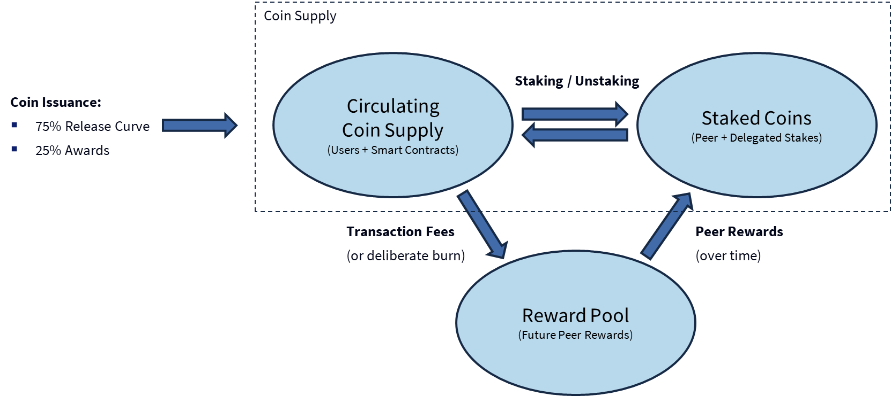

# CAD020: Tokenomics

## IMPORTANT LEGAL NOTICE

Yeah, we need a mandatory disclaimer here :-)

This repository discusses and describes tokenomics concepts in relation to the Convex network. It does not in any way represent a commitment on behalf of any party to implement the Convex Network in precisely the manner described, and may be subject to change based on learnings from Protonet or elsewhere.

The information contained in this repository is provided on an "as is" basis for informational and discussion purposes only, with no guarantees of completeness, accuracy, usefulness or timeliness.

This does not in any way constitute financial or legal advice. Participants in the ecosystem must take their own professional advice regarding any such issues.  

## Overview

Convex serves as a public utility network, where participants are free to transact on a decentralised basis. As such, there is a requirement for and economic protocol whereby users of the network can fairly compensate the providers of infrastructure for their services.

Convex Coins are initially issued in two ways:
- 75% are available for purchase on the **release curve**. This is is a mathematically defined mechanism that releases coins as and when demanded by economic participation in the ecosystem. Funds raised are reinvested in the ecosystem to create a virtuous cycle. 
- 25% are available as **awards** to contributors who add value to the ecosystem in various ways (can be software engineering, open source contributions, marketing, building great uses cases etc.). Contributions must benefit the ecosystem as a whole.

Once issued, coins are fully transferable and can circulate freely according to the wishes of their holders (e.g. traded on a private basis, used in smart contracts etc.). 

Coins used for transaction fees (or deliberately burned) are removed from the coin supply and a placed in a special "Reward Pool" which is released back to peer operators and stakers over time as a reward for maintaining the network. 

This model strikes the right balance between enabling long term sustainable growth and recognising those who bring value to the Convex ecosystem (financially or otherwise). There is a maximum supply cap of 1,000,000,000 Convex coins, though it will take a long time to get there. The total Coin supply at Protonet launch is 1m Convex Coins, initially held by Convex Foundation account(s) prior to onward distribution.

## Rationale / Discussion

All digital currencies must have a mechanism for initial issuance, and Convex is no exception. However, many existing mechanisms have significant flaws:

- **Protocol based issuance** - it is possible to issue tokens purely through the operation of the protocol, such as Bitcoin mining. Due to the mechanical nature, this is relatively predictable, automatic and trustworthy (at least to the extent that forks / upgrades to not fundamentally change the protocol). However, such approaches disproportionately incentivise infrastructure provision to the exclusion of all else: huge amounts of resources get consumed in Bitcoin mining, for example. This is undesirable because, at least for Convex, infrastructure provision is relatively cheap and efficient and can be well compensated through transaction fees alone - we want the majority of rewards to flow to people who add value to the ecosystem.
- **Pre-mining** - tokens can be generated "as if" they were mined and distributed to select parties (typically founding teams and early investors). The problem with this approach is that it creates a significant incentives for these parties to "cash out" at the earliest opportunity, often at the expense of later ecosystem entrants, and it reduces the incentives for insiders to continue to build the project. There is a significant danger of a negative "pump and dump" dynamic.
- **ICOs** - tokens can be generated and sold in a large public sale event. Such an event may generate a significant treasury for a foundation, and create broad public ownership. However, the price of such ICOs is hard to get right, and likely to attract significant speculative activity. Similar to pre-mining (which might occur alongside an ICO), there is a significant risk of "pump and dump" dynamics, often at the expense of less sophisticated retail investors.
- **Airdrops** - tokens can be distributed for free in large quantities according to a variety of eligibility criteria (in-person events, community membership, holding some other token etc.). While airdrops can create publicity and temporary excitement, giving out tokens for free risks devaluing the token by arbitrarily giving a windfall to individuals without them having to contribute anything. This is a disservice to those who truly do add value. It also incentivises negative behaviour in terms of attempts to benefit from future airdrops (signing up with multiple fake accounts etc.)

What we really need is a fair way to distribute coins that:
- is **proportionate** to contribution / value add to the ecosystem
- continues to **maintain good incentives** for contribution long after initial launch
- aligns **incentives** of participants (e.g. avoiding "pump and dump" by large holders or insiders)
- grows with the economic demand of the ecosystem on a **sustainable** basis

Hence we have defined a new approach of **market driven release**: new coins are issued as and when the economic growth of the ecosystem requires it. Purchasable coins are issued on demand if and only if they are purchased from the release curve that pre-defines a schedule of rising prices. If demand for coins is strong (i.e. market cap growth causes prices to rise above the current release curve price) then there is an economic arbitrage opportunity for purchasers to buy new coins from the release curve. This continues until equilibrium is reached, i.e the newly increased supply and new higher price equal the new market cap. 

This can be considered, in some ways, analogous to a company issuing new shares to raise capital. Existing shareholders will be diluted, but the extra injection of capital and resources increases the market value of the company so that they are still better off (hopefully, assuming the capital is well invested). There are however some notable differences with traditional equity:
- The Convex ecosystem is not a company, but a decentralised network of participants
- The release curve guarantees that previous purchasers will never be diluted by new coin issuance at a lower price: additional issuance must occur at a higher price (or at worst equal, if purchased from the same tranche). 
- There is a fixed maximum supply cap

## Design Objectives

The tokenomic model for Convex has been designed with the following objectives:

### Utility Token

The Convex Coin is a utility token - it represents the right to use the coins to access services provided by or on the Convex Network. As such, it should be broadly available as a decentralised asset to anyone wishing to use these facilities.

### Means of exchange

The Convex Coin serves as a means of exchange within the ecosystem, which can be used to facilitate efficient transactions between parties on a decentralised basis. As such, it must be convenient to use both by network users and autonomous actors / smart contracts as a digital currency.

### Ecosystem driven supply

The Convex coin supply is driven by ecosystem growth: new issuance occurs primarily due to ecosystem demand.

In the longer term, we would expect the Convex Coin to achieve a relatively stable value representing the utility of lattice technology powering a diverse ecosystem.

### Anti-dilution

We wish to provide a degree of assurance to coin holders that their holdings will not be diluted by large issuance of coins at a lower prices. Hence, the release curve will not offer coins for sale at a lower price than previous purchases.

### Equitable rewards for contribution

We must ensure that coins are distributed fairly, on the basis of making contributions to the Convex ecosystem. While there are many ways to contribute, we consider three categories of participants essential to reward fairly:

- **Contributors** : Those who help build the ecosystem, whether through contributions to Convex itself of building value in the broader ecosystem.
- **Coin Purchasers** : Those who help fund the development of Convex, by purchasing newly issued Convex Coins
- **Peer Operators**: Those who provide the infrastructure to operate the network on a decentralised basis

### DoS prevention

It is necessary to protect the network against the risk of DoS attacks enabled by flooding the network with unnecessary transactions, hence impeding the ability of regular users to transact normally and imposing unfair costs on peer operators.

### Sustainability

In the long term, the tokenomics should converge towards a stable steady state equilibrium, where the pricing of transactions is fair and balances the cost of providing services and infrastructure for the network.

## Specification

### Overview

The following overall tokenomic flows are possible:

- **Genesis** : The complete coin supply is generated and placed into governance accounts which are initially considered "unissued"
- **Issuance** : Coins are issued to either **Contributors** or **Coin Purchasers**
- **Transfers** : Holders of coins may freely transfer coins between accounts. These accounts may include autonomous actor accounts as well as external users.
- **Memory Accounting** : Coins may be exchanged for memory on the Global State. The memory accounting pool is considered a special governance account. See the Memory Accounting CAD for more details.
- **Transaction Fees** : Coins are taken from users who commit transactions to the network, and held in a peer reward pool for subsequent distribution to Peers. See the Transactions and Juice Accounting CAD for more details.
- **Peer Rewards** : **Peer Operators** may claim a share of the peer reward pool as they participate in running the network. See the Peer Staking CAD for more details. 

### Coin Supply

The issued coin supply is VARIABLE based on coin issuance via the Release Curve or contributor awards. It is denominated in Convex Coins.

Each Convex Coin MUST be sub-divided into 1,000,000,000 base units, referred to informally as "coppers" 

The Network must treat Convex Coins and coppers identically, i.e. the implementation should consider the range of possible coin values to be a value from `0` to `10^18`, where `10^9` is a Convex Coin.

Coins that are used for transaction fees (or deliberately burned) are removed from the coin supply and placed in a special Reward Pool that is used to pay rewards to peer operators and stakers. In this way, the coin economy becomes fully circular after initial issuance.

The Network MUST implement a technical fixed maximum coin supply cap of 1,000,000,000 Convex Coins. The number of issued coins at any time may be less than this amount, but can never exceed this amount.

Note: The maximum supply cap is chosen so that all valid coin balances can be expressed within a 64-bit long value, which allows for efficient implementation on most modern CPU architectures.

### Genesis

The genesis process in Convex includes the process of creating the initial Global State and establishing the first peer on the network, to which others can then connect. This genesis state is important for tokenomics because it established the initial coin allocation and the rules by which future coin allocations may be made.

#### Top Level Coin Allocation

The Network MUST divide the total initial supply of Convex Coins into two quantities:

- 75% for Coin Purchasers via the Release Curve
- 25% for contributor and ecosystem awards

#### Reserve accounts

The genesis MUST create a set of reserve accounts (`#1` to `#7`) which represent unissued coins. Such coins MUST NOT be considered part of the current coin supply. 

By reserving these amounts, we maintain the technical invariant that the total maximum supply cap of 1,000,000,000 Convex Gold is constant and coins cannot be created or destroyed - however the majority of these may not yet part of the current coin supply.

Any cryptographic keys for reserve accounts MUST be kept securely and governed according to the release tokenomics described in this CAD. The Convex Foundation will use air-gapped systems initially for this purpose. 

#### Genesis account

The genesis of the network MUST include a genesis account (currently `#11`) that is responsible for initial distribution of Convex Coins to start up the network.

The genesis account MUST receive funds from one or more reserve accounts to handle initial coin issuance for the following purposes:
- Performing any network setup transactions
- Establishing and staking the first peer on the network
- Making initial coin distributions to early purchasers and contributors

The genesis account MUST NOT have access to the majority of the reserve account funds, beyond what is necessary for the above. 

#### Distribution account(s)

The genesis process SHOULD define one or more secondary distribution accounts that will hold Convex coins temporarily before distribution to award recipients or purchasers.

The distribution accounts SHOULD NOT hold large balances of coins, and are only intended for short term holdings of coins that are already allocated to recipients (e.g. purchasers who have purchased coins, but not yet provided a public key or account into which the coins can be delivered). These balances are considered as issued (i.e. part of the current coin supply) but not yet distributed, i.e. still in the control of the governance body.

The governance body MUST ensure these accounts are securely controlled by authorised individuals to ensure legitimate distributions are made.

### Memory Exchange Pool

A certain amount of Convex Coins are placed in an AMM exchange for CVM memory allowances. Such coins are in effect locked under a smart contract, though should still be considered part of the overall coin supply as they are technically available for use (e.g. people selling back memory allowances).

The memory allowances themselves are a secondary native token used purely for memory accounting purposes.

See [CAD006 Memory Accounting](../006_memory/index.md) for more details.

### Release Curve

The release curve determines the price at which new coins are issued. There is an important economic principle behind this: more **coins only get released when prices go up** (i.e. hit new highs). This gives coin purchasers the assurance that they will never get diluted by new coin releases at lower prices, while still allowing for the coin supply to be increased as ecosystem demand grows.

Coin purchases MUST be priced in fiat currency or equivalent, consistent with the Release Curve defined in this section.

The price of a Coin on the release curve is defined as `$100 * x / (1-x)` where `x` is the proportion of coins released out of the total allocation for coin purchasers, and `$` represents United States dollars or equivalent currency.

Note: The constant value `$100` is chosen so that once `50%` of all coins are issued, the market cap of Convex Coins would be equal to `$50bn`. At this stage, one would expect the Convex Foundation to have a significant treasury available to give strong economic support to the Convex ecosystem in perpetuity.

The Release Curve formula MAY be adjusted in the event of significant economic events affecting the relative value of fiat currencies used (e.g. sustained high rates of inflation). The Foundation MUST consult with the ecosystem and provide a robust rationale for any such changes.

To account for transaction costs, effective financial management or purchaser convenience, the Foundation MAY group the release of some coins into rounds, provided that such rounds MUST be broadly consistent with the overall Release Curve.  

### Coin Purchases

The 75% allocation for Coin Purchasers MUST be distributed on the basis of purchases of coins in a manner consistent with the release curve.

The distribution MUST be administered by the Convex Foundation, or an entity acting on its behalf in accordance with relevant local regulations.

Coins purchases MUST be delivered to purchasers on demand after the release of the main network. Coin distribution MAY start early (during Protonet phase) subject to purchasers accepting the risk of doing so.

Coin purchasers MUST meet all relevant regulatory, legal and other requirements that may be defined to ensure that they are permitted to purchase Convex coins in their respective jurisdictions.

The Convex Foundation MUST sell coins on an equal, non-discriminatory basis to any purchaser that meets any relevant criteria.

The Convex Foundation MAY place restrictions on the rate that coins are distributed to early purchasers, giving consideration to the potential impact of large numbers of coins being issued at the same time.

In the long term, distribution of coins from coin purchasers SHOULD be operated on a fully decentralised basis, once technology, financial and decentralised governance capabilities are sufficiently robust to enable such a system (for example, having nation state currencies directly available on Convex).

The funds raised from coin purchases MUST be used in accordance with the objectives of the Foundation. For example, these may be used to fund ongoing development of the network, invest in key ecosystem initiatives, and as an incentive to reward those who contribute to the Convex ecosystem.

The funds raised SHOULD be managed as a long term fund by the Foundation to ensure the development of the network can be funded on a sustainable ongoing basis.

### Coin Awards

The 25% allocation for awards MUST be distributed by the Convex Foundation, in its role as the governance body of the Convex Network.

The Convex Foundation MUST make awards in the interest of developing the ecosystem, with a focus on awards to:
- Contributors who have made positive contributions to the development of Convex core technology
- Contributors who make positive contributions the the development of the community and ecosystem
- Infrastructure providers (such as peer operators) who help to ensure the security and reliability of the network
- Organisations or startups that help build the ecosystem by developing effective use cases

The Convex Foundation MAY require contributors to sign a Contributor's Agreement before award or distribution of coins.

The Convex Foundation MAY require contributors to verify their legal identity (KYC requirement)

The Convex Foundation SHOULD aim to ensure that the rate of awards remains broadly consistent with the ratio 25% : 75% relative to purchases from the release curve, with the understanding that this ratio may deviate from target in the short term.

The Convex Foundation SHOULD explore options for decentralised governance of awards. In the long term, decentralised governance SHOULD apply to all awards.
earn future awards.

### Vesting 

Early coin purchases via the FCPA (up to and during Protonet phase) are subject to a vesting schedule, reflecting the desire that early purchasers should remain committed to the ecosystem for a period of time, and to mitigate the potential destabilising effect of large simultaneous sales of coins.

Coin awards will not be subject to any vesting schedule as they are considered already "earned" by contributors. However, contributors are likely to wish to remain involved for other reasons e.g. building applications on top of Convex or wishing to stake their coins in various ways. 

### Transaction Fees

Transactions executed on the Convex network are subject to fees that reflect the cost of providing underlying network infrastructure to maintain the consensus network and global state.

Transaction fees are intended to be small, to encourage adoption and use of the Convex network. Transaction fees MUST NOT be zero to mitigate against denial of service (DoS) attacks on the network.

Transaction fees MUST be collected at the point of transaction execution, and placed in the Reward Pool for subsequent distribution to peer operators. This process MUST occur automatically as part of the network protocol. 

### Reward Pool

The Peer Reward Pool is stored in the special account `#0`. 

Transactions Fees for execution of transactions are deposited in the Reward Pool (this occurs at the end of each block of transactions successfully submitted by a peer and confirmed in consensus).

Over time, this Reward Pool is used to make payments for peers that are participating actively and correctly in maintaining network consensus, thus giving a return to stakers.

Account `#0` is also an address to which users can optionally "burn" coins. Such coins are removed from the circulating coin supply, but will be available for future distribution as peer rewards.

The Convex Foundation MAY, at its discretion, issue coins and immediately "burn" them in order to increase the incentives for peer operators to participate. Such coins will be considered to come out of the 25% available for contributor awards.

## Other considerations

### Secondary sale

Once issued, Convex Coins may be traded on secondary markets, e.g. via private sale or on digital asset exchanges. Such exchanges are beyond the scope of CAD020 and do not effect the overall coin supply (since they represent transfers between users and/or actors with coins that are already part of the coin supply).

For example: It is entirely legitimate business model to purchase coins from the Release Curve and offer them for sale to retail users of the network. This is good for the ecosystem because it enables innovation and diversity in the ways that Convex Coins are made available to end users.

### Wrapped / Locked Coins

It is possible to lock Convex Coins in an actor account / smart contract. Examples:
- Holding a deposit in escrow for a smart contract
- Liquidity pools on the Torus DEX
- "Wrapping" Convex Coins as CAD029 fungible token

Such coins are considered part of the coin supply, even though they are not immediately available for users: the rationale for this is that they can still be redeemed or withdrawn under various circumstances.

### Lost coins

It is possible to put coins beyond any possible future use in certain ways, e.g.:
- Transferring them to an actor account which has no way to return them
- Permanently losing the private key to a user account

Such coins are considered "lost". While technically still part of the coin supply, for practical purposes they are gone forever. 

### Fully Diluted Value

Some tokenomic analysis depend on the concept of "Fully Diluted Value", by multiplying the current price of tokens by some maximum supply cap.

Such analysis is generally invalid and SHOULD NOT be applied in the case of Convex, because full dilution cannot occur under the release curve model at the current price and such a number is effectively meaningless.

Analysts SHOULD use the market capitalisation of issued coins (i.e. the current coin supply multiplied by the market price) as the overall valuation for the Convex Coin, which more accurately represents the coin ecosystem. This is also consistent with valuation approaches for other tokens that do not have a fixed supply.

### Testnets

Testnets (i.e. any Convex based network other than the official main network) MAY alter or ignore any aspect of the tokenomics for testing, development or experimental purposes. Indeed, this is encouraged for the purposes of research and learning.

Test networks MAY implement a system of distributing free coins for testing purposes, e.g. a "faucet" which automatically issues testnet coins to users.

Participants in the ecosystem SHOULD NOT conduct economically significant activity on test networks, with the understanding that they have no assurance of the tokenomic model or governance over such networks, and may face significant security or legal risks if they do so.

### Disaster Recovery

In the event of a high severity event that substantially affects overall tokenomics, the governance body MAY take remedial action, up to and including requiring a mandatory network update to fix the issue. Such action will only be taken as a last resort, and MUST be done in a manner that minimises the impact on legitimate coin holders.

The governance body MUST NOT take any action which results in the modification of the coin balances of any 3rd party user or actor accounts, except where necessary to remediate the effects of a security breach as above.  