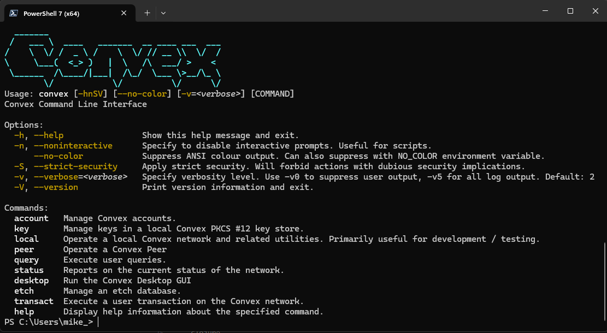

# Convex CLI

The Convex CLI (Command Line Interface) is a powerful tool for interacting with Convex from the command line on Windows, Linux and MacOS. It's a handy tool for system administrators and peer operators who need to script interactions with the Convex Network.



## Installation

The Convex CLI requires:
- A recent version of Java (21+, Java 25 recommended)
- A copy of the `convex.jar` executable jar file

Java is available from multiple providers, we recommend:
- [Oracle JDK](https://www.oracle.com/java/technologies/downloads/)
- [Eclipse Temurin JDK](https://adoptium.net/temurin/releases/) 

Snapshots of the `convex.jar` file are currently available here: [Convex Snapshots](https://drive.google.com/drive/folders/1AZdyuZOmC70i_TtuEW3uEKvjYLOqIMiv?usp=sharing)

## Running the CLI

To run the CLI, you simply need to run the following:

```
java -jar convex.jar <arguments>
```

It is often convenient to have a script, alias or batch file which executes the Java command to run the CLI. This means that you can simply type `convex ....` from any directory to access the CLI. The remainder of this document assumes you are using such a script.

### Windows

For Windows PowerShell, the following should work:

```
# Windows powershell - convex.ps1
function convex { 
  java -jar C:\path\to\convex.jar $args
}
```

Put this in your PowerShell profile (typically `Profile.ps1` in `$home/documents/PowerShell`) and the `convex` command should be available in all future PowerShell sessions.

### Linux

Run the following bash command (or add to your `~/.bashrc`) as follows:

```
alias convex="java -jar ~/convex.jar"
```

This will create an alias to the `convex.jar` so you can type `convex ....` in any directory to access the full set of CLI features.