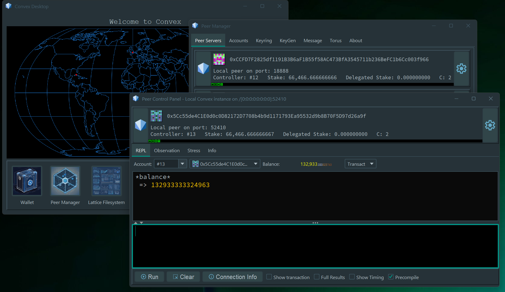

# Convex Desktop

Convex Desktop is a GUI tool for interacting with Convex. Designed for developers and power users, it puts all the capabilities of Convex at your fingertips.



## Installation

Convex Desktop requires:
- A recent version of Java (21+, Java 22 recommended)
- A GUI based operating system (e.g. Windows, Linux or MacOS)
- A copy of the `convex.jar` executable jar file

Java is available from multiple providers, we recommend:
- [Oracle JDK](https://www.oracle.com/java/technologies/downloads/)
- [Eclipse Temurin JDK](https://adoptium.net/temurin/releases/) 

Snapshots of the `convex.jar` file are currently available here: [Convex Snapshots](https://drive.google.com/drive/folders/1AZdyuZOmC70i_TtuEW3uEKvjYLOqIMiv?usp=sharing)

## Running Convex Desktop

If Java is correctly configured, you should be able to run Convex Desktop simply by double-clicking on the `convex.jar` file which will run Convex Desktop as an executable. On some systems, you may need to grant permissions to run a downloaded executable file.

Alternatively to run Convex Desktop, you can run the following commend from the command prompt, script or GUI shortcut:

```
java -jar convex.jar desktop
```
