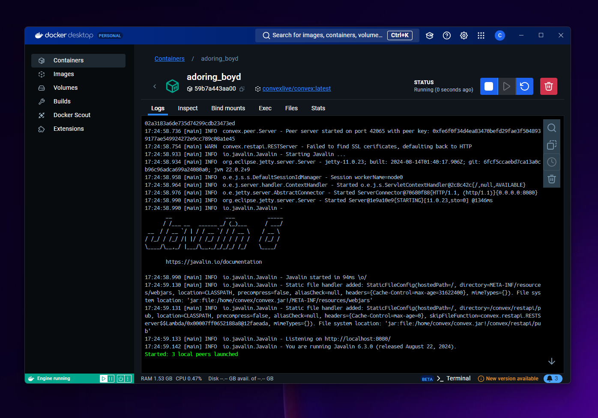

# Peer Container

Convex is packaged in the Peer Container for easy deployment via Docker-based systems



## Installation

The Peer Container is packaged as a docker container available on DockerHub

- [Peer Container on DockerHub](https://hub.docker.com/repository/docker/convexlive/convex)

The latest version is general available in docker as `convexlive/convex:latest`

## Running a Peer Container


```bash
docker run --name my-peer -d convexlive/convex:latest
```