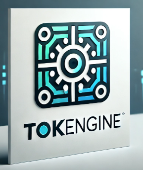

# Tokengine

TokenEngine is an open source cross-chain token interoperability bridge, designed to make the most of the efficiency and scalability of Convex for cross-chain economic transfers of value.

## About the project

Tokengine is an open source product supported by the Convex Foundation

The Tokengine project has been funded by the EU Next Generation Internet initiative as a solution for sustainable and efficient cross-chain interoperability. 

Tokengine is developed by Convex Ecosystem Services Limited in collaboration with [Werenode](https://werenode.com/).

## Key functionality

- Perform cross-chain swaps
- Wrapped tokens

## Supported Chains

### Convex 

Tokengine supports the following on Convex Protonet:
- Convex coins and 
- CAD029 token 

### EVM

Tokengine supports ERC20 tokens on any EVM-compatible chain

