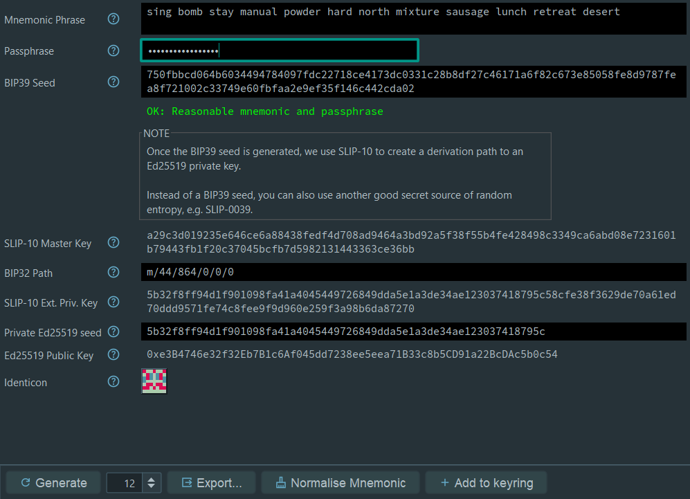
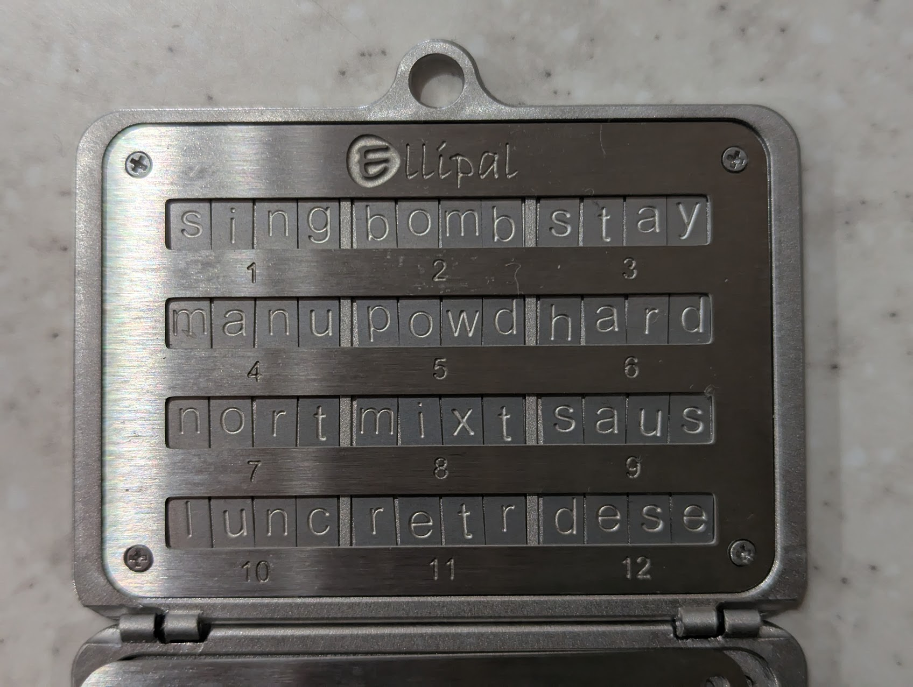

# Convex Coins

## About Convex Coins

Convex Coins (CVM) are the native utility token of Convex. They are used to transact on the Convex Network.  

Convex Coins can be subdivided into one billion coppers. `1 Convex Coin = 1,000,000,000 coppers`. This means that you can use small fractions of a Convex Coins, which may be useful for precise calculations or micropayments.


## Receiving Coins

You might receive Convex Coins for multiple reasons:
- Purchasing from the release curve
- Being awarded coins as a Convex contributor
- Receiving a payment, e.g. for goods and services that you provide
- Using a dApp that makes use of Convex Coins

So how do you actually receive them? They are a digital asset, after all, and you can't put them in your pocket.

To receive coins you need a **Convex account**. Convex accounts are recorded as part of the Convex global state, which is updated, verified and protected by peers of the decentralised network. Accounts hold a balance of Convex Coins and are designated with an address which looks like:

```
#23798
```

If you have an account you use already, that's great: you can just provide the address and receive coins directly. The sender can use this address to make any transfer to you as required.

### Getting an Account

Any user of the network can create an account for you. If you are new to Convex, the person or organisation sending you coins will normally do this for you. If you are a developer looking to build on Convex, hop on the Discord and a friendly person will probably give you one :-)

It is important to secure the new account so that only you can access it. Accounts and the coins they contain are protected by strong cryptography, so to do this you will need to provide an **Ed25519 public key**. This is usually shown as a 32-byte hex string that looks like:

```
0xe3B4746e32f32Eb7B1c6Af045dd7238ee5eea71B33c8b5CD91a22BcDAc5b0c54
```

Account are *psuedonymous*: The account public key or address alone doesn't identify you as an individual, but it is possible that others may discover additional information that associates you with the account. 

### Creating an Ed25519 key pair

You can create an Ed25519 key pair any way you like - there are multiple tools and software solutions that can do this for you and help you to secure your private keys.

One easy option is to use Convex Desktop. If you choose to create a key using Convex Desktop. The key generation screen looks like this:



At the bottom you can see the key pair generated:
- Private Ed25519 seed: `5b32f8ff94d1f901098fa41a4045449726849dda5e1a3de34ae123037418795c` (KEEP SECRET!!!)
- Ed25519 Public key: `0xe3B4746e32f32Eb7B1c6Af045dd7238ee5eea71B33c8b5CD91a22BcDAc5b0c54` (OK to share!)

To minimise risk, Convex Desktop does not save keys on your computer (unless you tell it to), so make sure you have taken an offline backup of the necessary information to recreate it. Typically you will want to keep:

```
Mnemonic: sing bomb stay manual powder hard north mixture sausage lunch retreat desert
Passphrase: hello1234567890ZZ
```

Note: The BIP39 path is always `m/44/864/0/0/0` by default. You don't need to remember this if you use the default, but if you change this then make sure you back this up too!

**DOUBLE CHECK**: Make sure you can independently recreate your key pair from the mnemonic and passphrase you have written down.

### Creating extra accounts

Once you have an account, you might want more than one. This can be useful for multiple reasons:
- Security: if you lose the key to one account, the others are safe
- Separating accounts for different purposes, e.g. developer work vs. savings
- Having an account that is shared with others with a limited balance
- Privacy: You don't want all your transactions going through a single account 

Alternatively, you might want to create an account for someone else so that you can transfer coins to them.

If you are a power user or developer, you can use the Convex REPL to create a new account. Example usage as follows:

```clojure
;; Create account with this desired public key. Make sure you use the PUBLIC key here!!
(create-account 0xe3B4746e32f32Eb7B1c6Af045dd7238ee5eea71B33c8b5CD91a22BcDAc5b0c54)
=> #21568

;; Send 100 Convex Coins to the new account
;; Note: 1 Convex Coin = 1000000000 coppers, so remember to add 9 zeros!
(transfer #21568 100000000000)
```

When you create a new account, make sure you record the account number. While it is possible to go and look back at transaction history and/or search for accounts that have your public key if you forget it, it's a lot easier if you just write down the account number!

## Securing your Coins

### Basic rules

NEVER give your private key (or the seed phrases used to create it) to anyone else. Anyone with access to these can sign transactions for your account, and steal your coins. As a wise man once said: Not your keys, not your coins!

ALWAYS ensure you are signing transactions on a device that you control and trust. For small coin to medium balances, your laptop may be fine. If you are at higher risk, sign transactions only on an air-gapped laptop (i.e. not connected to the internet).

### Physical Backups

If you have a significant holding of Convex coins, you may wish to keep a secure physical backup of your mnemonic phrase. Writing it down and putting it in a safe is an option, or you might choose to use something more durable like a metal seed phrase storage device (these are available relatively cheaply online).

Here's an example of a backup of the example mnemonic used above:

  

Don't forget to backup your passphrase as well (that can more plausibly be something that you can remember, but still, plenty of people have lost Bitcoin due to forgetting it....).

### Custodial Accounts

Some companies (e.g. exchanges) may offer custodial accounts on Convex. These accounts are similar to the self-custody account described above in that they have an address like `#82456` and can receive / send Convex coins, with two key differences:
- The company providing the custody will keep the private key safe. You don't have it.
- You can't execute transactions yourself: you will need to use the services of the custody provider (e.g. using their app)

Custodial accounts have the advantage that you don't need to manage your own key security. This can be easier for many users, and can be very secure if the custodial provider manages the keys properly on your behalf.

The risk is that you are dependent on the custody provider to keep the keys secure and faithfully execute transactions on your behalf. Only use custody providers that you trust!

### Account Controllers

Accounts can optionally specify a `*controller*`, which is a facility that allows other accounts to control your account.

Typical reasons to do this might include:
- You have a secure fallback account that you can use to recover coins and other assets if you lose the private key to your regular account 
- You want to control your account via code (e.g. via a smart contract)
- You want a trusted third party to have the ability to recover your account even if you lose your keys
- An app may set itself as the controller so that it can restore / take actions in your account on your behalf

This is a useful and powerful feature but it should be **used with caution**. Account controllers have full control of the account: they can change the keys, move funds etc. Do not set a controller unless you trust the controller account to act in your best interests. At the very least, you should expect the controller account to be **more secure** than the account that it controls.

