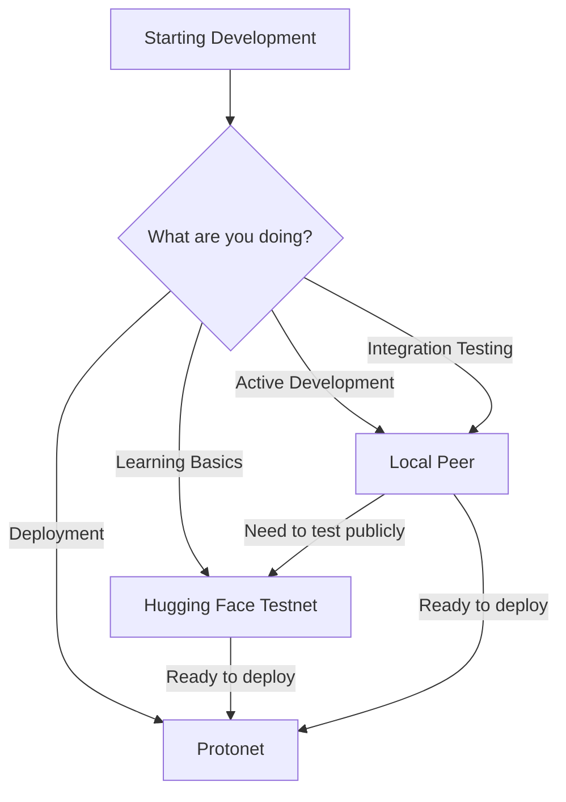

# Networks

Understanding Convex networks and choosing the right one for your needs.

## Network Reference

Quick reference for available Convex networks:

| Network | Type | HTTP Access | Binary Access | Faucet | Genesis Hash |
|---------|------|-------------|---------------|--------|--------------|
| **Protonet** | Production | `https://peer.convex.live` | `peer.convex.live:18888` | ❌ No | `0xb0e44f2a...` |
| **Hugging Face Testnet** | Testnet | `https://mikera1337-convex-testnet.hf.space` | ❌ Not available | ✅ Yes | *(varies)* |
| **Local Peer** | Development | `http://localhost:8080` | `localhost:18888` | ✅ Yes | *(varies)* |

**Connection Types**:
- **HTTP Access** - REST API for web apps, simple integration (HTTPS/JSON)
- **Binary Access** - Direct peer protocol for higher performance (TCP binary, not available on all networks)

**Note**: Genesis hashes for testnets and local peers change when networks reset or restart.

**→ [Peer Operations Guide](peer-operations)** - Connection details, verification, troubleshooting

---

## What is a Convex Network?

A **Convex network** is a decentralized lattice-based system where multiple peer nodes work together to maintain a shared global state. Unlike traditional blockchains, Convex uses lattice technology and Convergent Proof of Stake (CPoS) consensus to achieve high performance and instant finality.

### Key Characteristics

**Decentralized Architecture**
- Network of peer nodes maintaining consensus
- No central authority or single point of failure
- Cryptographically secure state transitions

**Lattice Technology**
- State merges like CRDTs (Conflict-free Replicated Data Types)
- Not a linear blockchain
- Enables parallel transaction processing

**Global Shared State**
- All peers converge on the same state
- Atomic transactions with cryptographic signatures
- Self-sovereign accounts with Ed25519 keys

**Consensus Mechanism**
- Convergent Proof of Stake (CPoS)
- Sub-second consensus finality
- Byzantine fault tolerant

## Network Types

### Production Networks

**Purpose**: Real-world applications with actual value

**Characteristics**:
- ❌ No public faucets (Convex Coins have real value)
- ✅ High reliability and uptime
- ✅ Persistent state (never resets)
- ✅ Professionally operated infrastructure
- ⚠️ Requires funded account to transact

**When to Use**:
- Deploying production applications
- Managing real assets
- Interacting with mainnet smart contracts

### Test Networks (Testnets)

**Purpose**: Testing and learning without risk

**Characteristics**:
- ✅ Public faucets available (free test funds)
- ✅ Safe for experimentation
- ⚠️ May reset periodically
- ⚠️ No real value (test Convex Coins only)
- ✅ Publicly accessible

**When to Use**:
- Learning Convex development
- Testing applications before deployment
- Experimenting with smart contracts
- Demonstrating features to others

### Local Development Peers

**Purpose**: Private development environment

**Characteristics**:
- ✅ Full control over configuration
- ✅ Fastest performance (no network latency)
- ✅ Built-in account creation and funding
- ✅ Perfect for unit/integration testing
- ✅ Works offline
- ⚠️ Requires running peer infrastructure

**When to Use**:
- Active development and debugging
- Running automated tests
- Learning Convex internals
- Building without network dependency

## Known Networks

### Protonet (Production)

Convex's main production network for real-world applications.

**Connection**:
- **HTTP**: `https://peer.convex.live`
- **Binary**: `peer.convex.live:18888`

**Details**:
- **Genesis Hash**: `0xb0e44f2a645abfa539f5b96b7a0eabb0f902866feaff0f7c12d1213e02333f13`
- **Faucet**: ❌ No
- **Funding**: Requires funded account or transfer from existing account

**⚠️ Important**: Verify the [genesis hash](peer-operations#verifying-network-identity) before submitting production transactions.

---

### Hugging Face Testnet

Public testnet hosted on Hugging Face Spaces with faucet support for testing and learning.

**Connection**:
- **HTTP**: `https://mikera1337-convex-testnet.hf.space`
- **Binary**: ❌ Not available (HTTP only)

**Details**:
- **Faucet**: ✅ Yes
- **Hosting**: Hugging Face Spaces
- **Resets**: May reset periodically (genesis hash will change)
- **Use For**: Learning, testing, experimentation
- **Limitation**: HTTP access only, use local peer for binary protocol testing

---

### Local Development Peer

Run your own peer locally for maximum performance and control.

**Connection**:
- **HTTP**: `http://localhost:8080`
- **Binary**: `localhost:18888`

**Details**:
- **Performance**: &lt;1ms latency (fastest option)
- **Control**: Full configuration access
- **Privacy**: No network exposure
- **Faucet**: Built-in account creation and funding

**→ See**: [Peer Operations - Local Testnets](peer-operations/local-testnets) for setup options.

---

### Finding More Networks

Additional test networks and community-run peers:

- **[Discord Community](https://discord.com/invite/xfYGq4CT7v)** - `#network-status` channel
- **[Convex Foundation](https://convex.world)** - Official announcements
- **Community Forums** - User-operated test networks

**Note**: Always verify network URLs before connecting, especially for production use.

## Choosing the Right Network

### Decision Guide

| Scenario | Recommended Network | Why |
|----------|-------------------|-----|
| **First time learning** | Hugging Face Testnet | No setup required, safe to experiment |
| **Daily development** | Local Peer | Fastest, binary protocol, full control |
| **Integration tests** | Local Peer | Deterministic, fast, isolated |
| **Public demos** | Hugging Face Testnet | Accessible to others, persistent |
| **Staging tests** | Hugging Face Testnet | Production-like environment |
| **Production app** | Protonet | Real value, high reliability |

### Development Workflow



### Quick Start by Use Case

**Learning Convex** → Use **Hugging Face Testnet** (`https://mikera1337-convex-testnet.hf.space`)
- No setup required • Free test funds • Safe to experiment

**Building an Application** → Use **Local Peer** ([setup guide](peer-operations/local-testnets))
- Fastest iteration • Full control • Binary protocol • Works offline

**Deploying to Production** → Use **Protonet** (`https://peer.convex.live`)
- Real value • High reliability • [Verify genesis hash](peer-operations#verifying-network-identity)!

## Connecting to Networks

All networks support the same client API. Simply change the URL to switch networks:

```java
// Testnet
Convex convex = Convex.connect("https://mikera1337-convex-testnet.hf.space");

// Production
Convex convex = Convex.connect("https://peer.convex.live");
```

**→ See [Peer Operations Guide](peer-operations)** for:
- Connection types (HTTP vs binary protocol)
- Configuration and timeouts
- Genesis hash verification
- Health monitoring
- Troubleshooting

## Security Considerations

### Production (Protonet)

- ✅ **Always verify genesis hash** - See [verification guide](peer-operations#verifying-network-identity)
- ✅ Use HTTPS for encrypted connections
- ✅ Never share private keys or seed phrases
- ⚠️ Transactions are irreversible
- ⚠️ Test thoroughly on testnets first

### Testnets

- ⚠️ Never use production keys on testnets
- ⚠️ Testnets may reset without notice
- ⚠️ Test funds have no real value
- ✅ Safe to experiment and make mistakes

### Local Peers

- ✅ Completely private (no network exposure)
- ✅ Safe for testing with production-like keys
- ⚠️ State is ephemeral unless persisted

## Next Steps

### Getting Started

- **[Peer Operations](peer-operations)** - Detailed connection guide, verification, troubleshooting
- **[Client SDKs](/docs/tutorial/client-sdks)** - Connect from your programming language
- **[Faucet Guide](/docs/tutorial/coins/faucet)** - Get test funds for testnets

### Advanced Topics

- **[Client Types](/docs/tutorial/client-sdks/java/clients)** - HTTP vs binary protocol
- **[Convex Peer](/docs/products/convex-peer)** - Run your own production peer
- **[Account Management](/docs/tutorial/client-sdks/java/accounts)** - Keys and accounts

## Resources

- **[Discord Community](https://discord.com/invite/xfYGq4CT7v)** - Network status and support
- **[Convex.world](https://convex.world)** - Official website
- **[GitHub](https://github.com/Convex-Dev/convex)** - Source code
